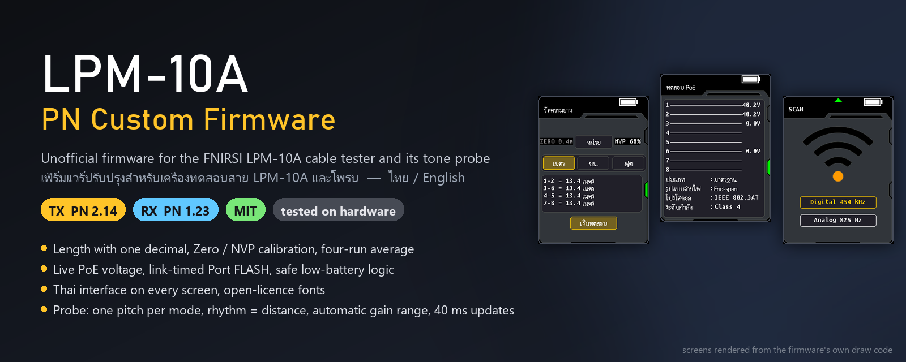
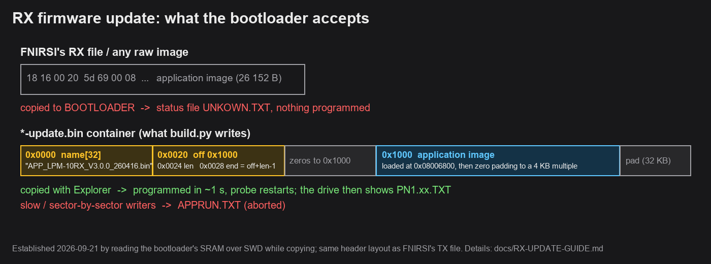
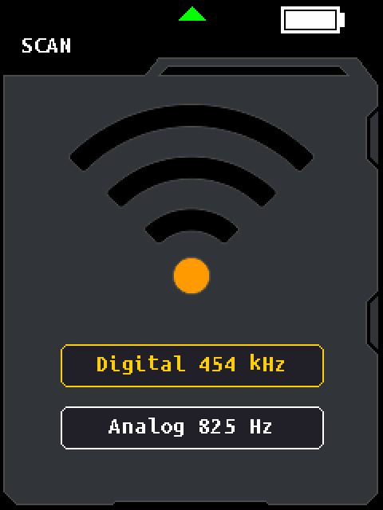
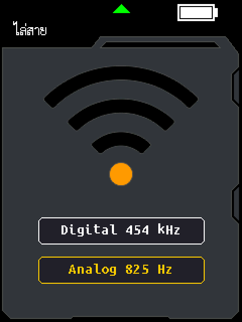
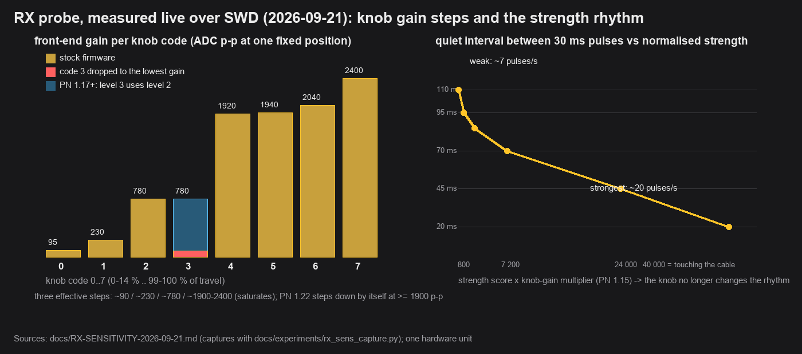
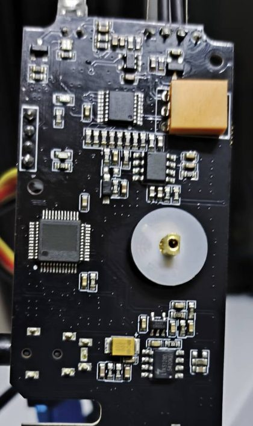

<div align="center">

# LPM-10A PN Custom Firmware

Unofficial firmware for the **FNIRSI LPM-10A** network cable tester (TX) and its tone probe (RX).
Built by patching the shipped binaries — no vendor source — and verified by emulation and on a real unit.

  



</div>

## Current firmware

| Device | Version | Download | File to copy |
|---|---|---|---|
| **TX** tester | **PN 2.27A** | [Release v2.27A](https://github.com/patnawa/LPM-10A_PN_Custom/releases/tag/v2.27A) | `LPM-10A-TX_PN2.27A-analog-alignment.bin` |
| **RX** probe | **PN 1.24** | [Release rx-v1.24](https://github.com/patnawa/LPM-10A_PN_Custom/releases/tag/rx-v1.24) | `APP_LPM-10RX_PN1.24-gain-precision-update.bin` |

The owner reports **TX PN2.27A passed device testing paired with RX PN1.24 (2026-09-22)**.
This release reduces carrier-switching work and aligns Analog modulation to nominal 816.832 Hz,
displayed as **Analog 817 Hz**. Digital timing and the PN2.26 QC/Length fixes are retained.
See the [PN2.27A analysis and validation](docs/TX-TONE-PRECISION-PN2.27-2026-09-22.md).
The owner confirms **RX PN1.24 passes without Digital or Analog signal dropouts (2026-09-22)**.
It improves gain recovery, rejects expired measurements and reduces Analog processing work.
See the [PN1.24 analysis and validation](docs/RX-GAIN-PRECISION-PN1.24-2026-09-22.md).
Each release carries its notes and a SHA-256 file. **TX and RX firmware are not interchangeable.**
FNIRSI's own files are not redistributed here.

The default TX build reproduces the exact owner-tested PN2.27A file. PN2.27 remains an
archived comparison with the original Analog frequency; its standalone device status is unconfirmed.

> **สรุปภาษาไทย:** TX ใช้ PN 2.27A, RX ใช้ PN 1.24 · TX อัปเดต: ปิดเครื่อง → กด **M + Power** ค้าง → เสียบ USB → ก๊อปปี้ไฟล์ ·
> RX อัปเดต: ปิดเครื่อง → กด **SCAN** ค้าง → เสียบ USB → ไดรฟ์ `BOOTLOADER` → ก๊อปปี้ไฟล์ **`-update.bin`** ด้วย Explorer →
> ไดรฟ์หายใน 1 วิ = เสร็จ · รายละเอียดและวิธีย้อนกลับ: [คู่มืออัปเดต RX](docs/RX-UPDATE-GUIDE.md)

## Install

### TX (tester)

1. Check the download: `certutil -hashfile LPM-10A-TX_PN2.27A-analog-alignment.bin SHA256` →
   `c12b127a634baa038c2504b8e30262a38f963c4900e0967094d7a7f4b1084420`
2. Tester off. Hold **M + Power** until the firmware-update screen appears.
3. Plug in USB-C; a removable drive appears.
4. Copy the `.bin` onto the drive. Do not unplug while it writes.
5. Long-press Power to shut down, then power on. Settings › About shows `Software:PN2.27A`.
6. If QC Test requests Init, **disconnect all cables and hold Right until Init succeeds**.
   This is required once for calibration made before PN2.25; a successful PN2.25 Init is retained.

If the drive refuses the file, rename it exactly `LPM-10A-TX_V2.0.7_260610.bin` and copy again
(some bootloaders match on the file name; the name inside the image is already the stock one).
**Back to stock:** same procedure with FNIRSI's `LPM-10A-TX_V2.0.7_260610.bin`
([fnirsi.com](https://www.fnirsi.com) → downloads). The bootloader and its update screen are never touched.

### RX (probe) — read this, the FNIRSI file will not work as shipped

1. Probe off. **Hold SCAN**, plug USB into the PC. A drive named **`BOOTLOADER`** appears.
2. Copy **`APP_LPM-10RX_PN1.24-gain-precision-update.bin`** onto it with Explorer (an ordinary copy).
3. Within about **one second the drive disappears**: the probe has programmed the file and restarted.
   Unplug USB; press the power key if it is silent. PN 1.14+ chirps high→low at power-on; entering the
   drive again (no copy) shows `PN1.24.TXT`, the installed build.

Only the **`-update.bin` container** is accepted. The raw image FNIRSI ships for the RX — and every
`.bin` without `-update` — is silently ignored (the drive's status file shows `UNKOWN.TXT`). Slow or
sector-by-sector copy tools make the bootloader give up (`APPRUN.TXT`). **Back to stock:** wrap FNIRSI's
`APP_LPM-10RX_V3.0.0_260416.bin` with `python -m lpm10rx.container wrap …` and copy it the same way.
Everything about the RX update — why it never worked, the container format, what was changed, status
files, rollback, troubleshooting — is in **[docs/RX-UPDATE-GUIDE.md](docs/RX-UPDATE-GUIDE.md)** (Thai + English).



## What PN changes

There is no vendor source. PN patches FNIRSI's shipped binaries: it disassembles them, adds code in
unused flash (TX: the tail of the last used sector, RX: appended after the image), re-assembles and
verifies the result — every patch is checked instruction by instruction, the TX screens are rendered
from the firmware's own draw code, and the RX helpers are executed on a CPU model. Below, each change is
explained: what stock does, what PN does, how it works and how it was checked.

### TX (tester) — summary

| Area | Stock | PN Custom |
|---|---|---|
| Length display | whole metres, cm forced on every entry | **m / cm / ft with one decimal**, unit remembered |
| Cable calibration | none | **Zero 0.0–2.0 m and NVP 50–99 %** on the Length screen, saved (factory = 0.0 m / 69 %); **REF**: dial the known length of a cable and NVP is solved from it — after the measurement or before it |
| Length stability | one TDR run (±0.3 m scatter at 14 m) | **four runs averaged per pair**; `~` marks pairs with fewer runs; the Testing line counts the runs `1/4 … 4/4` |
| Blind pairs | `0.0 m` | **`< 2 m`** (`< 200 cm`, `< 7 ft`): the PHY cannot time echoes inside ~2 m |
| Low battery | one sample < 3150 mV starts an uncancellable 30 s shutdown | three consecutive samples; cancels on recovery or charging |
| Battery gauge | 4 steps | 10-step Li-ion curve, red at ≤ 20 % |
| Auto Off | keeps counting during a SCAN tone or FLASH blink | held while a tone or blink session runs |
| Port FLASH | fixed phase counter | blink timed from the PHY link; 1.5 s on / 1 s off minimum; back-off 4 → 8 → 16 s |
| PoE screen | voltage drawn once; blank without a supply | **voltage refreshed every 0.5 s**; "Detecting…" then "No PoE"; "Standard : Yes / No" |
| Tone (SCAN) menu | Noiseless / Normal | **Digital 454 kHz** and **Analog 817 Hz**; specialized carrier switching and Analog alignment with the RX filter |
| SPEED | resolved speed and duplex only | + a **Switch** row: the speeds the port advertises (`10/100/1000`, `10/100`, … `No autoneg`) — a 100 Mbps link on a gigabit port points at the cable, on a 10/100 port at the port |
| Cable Test | one ADC sample per pin, "open" only 77 mV under the rail → random open / crossed wires on a cable plugged into nothing; pass / fail only; Back leaves the screen; error text hidden under a button | **eleven samples per pin, the median decides**; Switch mode needs a real short; **Not connected** when nothing is at the far end; **every wire ends with its reading** (partner pin + reading in Switch mode, the RX unit's ladder value otherwise); modes named Switch / **RX unit**; the message line is wiped before every test; Back returns to the mode choice; error line visible |
| Language | Chinese / English | **ไทย / English** on every screen; picker on first boot |
| Font | thin serif | Ubuntu Sans Mono + Sarabun (Thai), rendered from the firmware's own layout tables |
| Reliability | heap leak on settings save, timer-path logging, FP crash frame | fixed; watchdog on the service task; fault records kept across warm reset |
| QC Test | raw pulse counts depend on the actual task delay | **Classic screen and continuous automatic testing**; counts normalized to the actual measurement duration; three passing observations before green, immediate fault classification; clean Init prompt |
| Identity | `Software:V2.0.7`, fnirsi.cn | `Software:PN2.27A`, this repository's URL, and `BATT / NVP / ZERO` on the About screen; bootloader-facing image name unchanged |

### TX (tester) — in detail

<details>
<summary><b>Length: one decimal, m / cm / ft, unit remembered</b></summary>


*Stock* shows whole metres (`cm/100`, rounded), offers inches (`cm / 2.54`, truncated) rather than feet,
and forces the unit back to cm every time the screen is opened.

*PN* keeps the PHY's centimetre value all the way to the display and prints it with one decimal:
`m: (cm + 5) / 10` tenths, `cm: cm`, `ft: (cm × 1000 + 1524) / 3048` tenths — integer arithmetic,
rounded, using the firmware's own `sprintf`. The unit lives in settings byte `0xA7` (a byte stock ignores)
and survives power cycles. A value that would not fit the field prints `OVR` instead of overflowing.
</details>

<details>
<summary><b>Cable calibration: Zero and NVP</b></summary>

The tester does not time pulses itself; it runs the *Cable Status Diagnostic* of the Motorcomm YT8531
PHY, which reports one centimetre value per pair. That value is `v_assumed × t / 2`, where `t`
includes the chip's own signal path, so the reading is really `k × length + offset` with two unknowns:

- **NVP** (nominal velocity of propagation, 0.64–0.70 for twisted pair, different for every cable
  batch) fixes `k`. Every percent of NVP error is a percent of length error; stock used one fixed
  constant inside the PHY (equivalent to 69 %).
- **Zero** fixes `offset`: on the tested unit every length read about **+0.4 m** too long — the delay
  through the PHY front end and connector, which no factor can remove.

PN computes `length = (raw − Zero) × NVP / 69`, exactly:
`cm0 = cm − 10 × Zero` (≤ 0 → 0), then `cm' = (cm0 × NVP + 34) / 69`. Zero is 0.0–2.0 m in 0.1 m steps
(settings byte `0xC5`), NVP 50–99 % (byte `0xA6`); 0.0 m / 69 % reproduces stock's number exactly, so
the factory state is unchanged. Both are shown on the Length screen (`ZERO 0.4m` left of the Unit box,
`NVP 68%` right): UP / DOWN change the white one (hold for auto-repeat), **hold OK about a second** to
swap which is white; every change redraws the four readings at once, no re-measure needed. Saved when
leaving the screen and at power-off; Factory Reset returns to 0.0 m / 69 %.

Calibrating with two cables of known length L₁ (short, ~3 m) and L₂ (long, ≥ 15 m), raw readings R₁, R₂
at 0.0 m / 69 %: `NVP = 69 × (L₂ − L₁) / (R₂ − R₁)`, `Zero = R₁ − L₁ × 69 / NVP`. On the tested unit a
2.9 m cable read 3.34 m and a 14 m cable 14.7 m → NVP ≈ 67 %, Zero ≈ 0.4 m; dialled in on the screen it
settled at **Zero 0.4 m, NVP 68 %**. Worked example at those settings: run mean 1470 cm → 1470 − 40 = 1430
→ (1430 × 68 + 34) / 69 = 1409 → (1409 + 5) / 10 → **14.1 m**.

**REF** (PN 2.18, PN 2.22 / 2.23) does the long-cable step for you: holding OK cycles NVP → ZERO → **REF**.
With a result on screen REF starts at the measured length, UP / DOWN dial it to the cable's true length
(0.1 m, 10 cm or 0.1 ft per step) and every step solves `NVP = 69 × REF / (raw − 10·Zero)` from the mean of
the timed pairs (rounded, 50–99 %), shows it in grey on the right and redraws the four readings. Without a
result REF starts at 10.0 m: dial it to the cable's true length, press OK to measure (far end open) and the
result is fitted to it once — the measurement after that is an ordinary one, a REF target left behind never
re-fits NVP by itself. Zero stays the short-cable step; NVP is saved on leaving the screen as before.
</details>

<details>
<summary><b>Four-run average and the <code>~</code> mark</b></summary>

The PHY resolves the echo to about ±1.5 ns per run, which at NVP 0.68 is ±0.3 m — the run-to-run scatter
seen on the bench (±0.2 m at 3 m, ±0.3 m at 14 m). Stock showed one run as is (with a single retry when
the four pairs disagreed). PN runs the diagnostic **four times** and averages each pair over the runs in
which it returned a non-zero value (`mean_i = floor(Σ runs_i / n_i)`); the 20 s timeout restarts per
run, so a test takes four times longer. A pair that yielded only 1–3 runs is marked `~`. This halves the
scatter and is why the calibration above settled from 0.5 m to 0.4 m. Since PN 2.15 the Testing line counts
the runs at its right end, `1/4 … 4/4`, so the wait is understood.
</details>

<details>
<summary><b>Blind pairs: <code>&lt; 2 m</code> instead of <code>0.0 m</code></b></summary>

Below about 2 m the echo returns while the pulse is still being launched and the PHY reports nothing
usable; stock discards raw readings ≤ 200 cm (before Zero is subtracted) and printed such a pair as
`0.0 m`, which reads like a measurement. PN prints **`< 2 m`** (`< 200 cm`, `< 7 ft`) for a pair whose
converted value is 0, and still says *Out of range* when all four are zero. On a long cable such a pair is
open within its first two metres; the Cable Test (wiremap) screen tells which one. This is the PHY's
limit, kept as is: a 1 m cable is not measurable (an experimental build lowers the cut-off to 0.5 m only
to collect raw readings).
</details>

<details>
<summary><b>Low-battery shutdown and the battery gauge</b></summary>

Pack voltage is `mV = raw × 2 × 3300 / 4096` (12-bit ADC, 3.3 V reference, 1:2 divider; 1 LSB ≈ 1.6 mV),
sampled once a second, skipped while a test runs, armed only with no charger connected.

*Stock* started an **uncancellable 30 s shutdown from a single sample below 3150 mV** — one noisy sample
(a beep burst is exactly the load that dips a tired cell) could switch the tester off mid-job; only a
charger cancelled it. *PN* arms it after **three consecutive samples** below 3150 mV (≥ 3 s), cancels it
when the pack reads ≥ 3250 mV again or the charger is connected (100 mV hysteresis), and clears the
debounce on cancellation and at start-up. Charger state is GPIO (PC10 low = charging, PA15 low = full),
unchanged.

The gauge had four values (`> 4000 → 100`, `> 3800 → 80`, `> 3600 → 50`, else `20`) and the icon only drew
those four. PN uses a single-cell Li-ion open-circuit curve in ten steps (`≥ 4150 → 100, ≥ 4050 → 90,
≥ 3950 → 80, ≥ 3870 → 70, ≥ 3800 → 60, ≥ 3750 → 50, ≥ 3700 → 40, ≥ 3650 → 30, ≥ 3600 → 20, ≥ 3450 → 10,
else 0`), the icon draws `pct / 10` segments and turns red at ≤ 20 %. Stock's debounce (a new
percentage after two agreeing samples; it only falls while discharging) is kept.
</details>

<details>
<summary><b>Auto Off held during a tone or blink session</b></summary>

Auto Off is `{OFF, 5, 10, 15}` min, reset on every key and after every Length / Speed result. Stock kept
counting while the SCAN tone or the Port FLASH blink was running, so a tracing session ended with the
tester switching itself off. PN holds (and restarts) the counter while a tone or blink session is active
and leaves everything else as stock. (PN 1.0–2.2 held it during SCAN only — the FLASH branch compared
the wrong state number; fixed in PN 2.3.)
</details>

<details>
<summary><b>Port FLASH timed from the PHY link</b></summary>

Port FLASH makes a switch port's LED blink so you can find the port. The tester advertises 10BASE-T only
(the fastest-linking speed), and stock ran a fixed 5 s phase counter (4 s PHY up, 1 s down) that ignored
whether the link had actually come up — the switch's own re-link (Clause 28 break-link timer plus
auto-negotiation, 2–3 s) ate most of the "up" window, and a GPIO input pattern could restart the hold
timer indefinitely (LED stuck on).

PN polls every 500 ms and drives the cycle from the PHY's link state: wait for link (re-asserting
power-up every tick, power-cycling again after 4 s without a link) → hold **1.5 s** from the tick that saw
the link → PHY off for **1 s** minimum → power-up → wait for link. Failed negotiations back off 4 → 8 →
16 s and the working window is kept for the session; the tester's own LED and screen indicator follow
the same published link state. Since PN 2.12 the link comes from the PHY's current status register
(historical latch-low status cleared, all-ones MDIO reads rejected) and battery monitoring stays active
during FLASH. Confirmed on a D-Link gigabit switch. Links needing more than 16 s can still fail.
</details>

<details>
<summary><b>PoE screen: live voltage, "Detecting…", "No PoE"</b></summary>

PoE voltage is `mV = (max − min of 4 ADC channels) × 3300 × 40 / 4096` (1:40 divider); the class comes
from two comparator inputs (PA6/PA7 → 802.3af / at / bt / bt, printed as Class 3 / 4 / 6 / 8).

*Stock* drew the voltage **once**, from the sample a tick or two after the first one above 40 V, and never
refreshed it while the screen was shown (the two wires of a pair could even disagree); with no supply
the screen stayed **blank**, because its 3.5 s "no supply" timeout fired once per power-on — usually
before the screen was ever opened — and was never re-armed. *PN* refreshes the voltage column **every
0.5 s** while a supply is present (every wire from one latched sample), clears it the moment the supply
goes, shows **"Detecting…"** on entry and **"No PoE"** 3.5 s later without a supply, every time, and
prints "Standard : Yes / No" instead of "Standar / UnStandar". The stock "unstable supply" check compares
byte data against 40 000 and can never trigger; it is documented and left alone. The supply paths were
verified by emulation; the no-supply path on hardware (no PoE switch or injector was available).
</details>

<details>
<summary><b>Tone menu: Digital 454 kHz and Analog 817 Hz</b></summary>

The SCAN screen drives the cable with a ~454 kHz carrier from TIM1. TIM2 services modulation every
101 microseconds. **Digital** keys the carrier with the 16-slot code `0xB6B6` (period 8 chips,
5.05 ms per chip) that the probe's Digital mode decodes. **Analog** uses a local phase accumulator
at nominal 816.832 Hz, close to RX PN1.24's target filter bin, without changing the shared timer.
Stock labelled them "Noiseless" and "Normal"; PN labels the carrier and modulation frequencies.
PN2.27A specializes carrier GPIO switching and inherits the fixes for one lost tick at the
digital wrap, the debug logging in the timer path, the stale carrier state after Pause and a RIGHT-key
carrier-cache defect, and removes two experimental modes (Sync32, Pulse test) that the probe does not
use. Pair TX Digital with RX Digital and TX Analog with RX Analog.
</details>

<details>
<summary><b>Cable Test: "Not connected" instead of a guess; the reading on every wire; Switch / RX unit</b></summary>

The wire map drives one tester pin and reads the other eight through the ADC. *Stock* took **one sample**
per pin, 2 ms after switching the mux, and called a pin open only when all eight readings were above
4000 of 4095 — 77 mV under the rail. A cable plugged into nothing floats on the tester's pull-up and picks
up mains hum, so single samples crossed that line at random: Switch mode then called the pin connected
(its rule was "any other pin at or below 4000"), far-end mode went on to guess which remote pin it had
reached — a different pattern of open / crossed wires on every Test Retry, and no "nothing connected"
state at all.

*PN* (2.19) reads every sensed pin **eleven times, 1 ms apart** — a half-cycle of mains — and uses the
median where stock used the sample (the highest of the eleven for far-end mode's open test: a floating
wire touches the rail within a half-cycle, a wire on the RX unit's resistor ladder does not). Switch mode
counts a pin connected only through a real short (≤ 1240, the far-end routine's own short value), since a
switch port joins the two wires of a pair through its transformer winding. When all eight signal pins
are open the screen says **Not connected** / ไม่พบปลายสาย; G (the shield) shows open on an unshielded cable
or a switch and is not counted. The second mode is named for what you plug in, **RX unit** / เครื่องรับ. A
test takes about 0.9 s instead of 0.15 s; the thresholds and the remote ladder table are stock's.
(PN 2.20: the message line under the wires is wiped before every test — a Test Retry from the result
screen never redrew it, so a message could outlive its result.)

PN 2.21 puts the reading that decided each wire at its right end, in the wire's colour (red for an open
wire, yellow for a short). In Switch mode it is the partner pin and the reading — `2   60` — so a good
cable reads `2 1 6 5 4 3 8 7` down the rows and a single swapped wire shows the wrong letter where stock
only draws green; `- 4037` means nothing reached. In RX unit mode it is the ladder value alone, which *is*
the remote pin (1655 pin 1 … 3679 pin 8, 3900 shield), so a crossover cable shows its crossing lines and the
swapped values. A floating wire well under 4095 (say 3800) is leakage or moisture; a switch partner well
above 60 (say 300) a poor contact. Nothing about the decision changes.

Stock's Back key also left the Cable Test screen from every step, and the red "Result error!!" line was
painted underneath the Test Retry button. PN's Back returns to the Switch / RX unit choice from the armed
and result screens (a `tbb` byte and two spare `nop`s at the key handler), and the button moved 9 px down
so the message line sits above it.
</details>

<details>
<summary><b>SPEED: what the port offers, next to what the link got</b></summary>

Stock negotiates a link and prints the resolved speed and duplex from the PHY's status register — what
you got, not what the port could do. PN (2.17) adds a **Switch** row from the two IEEE 802.3 registers
every PHY has and stock never read: register 5 (the partner's advertised 10 / 100 abilities) and
register 10 (1000BASE-T status). `10/100/1000`, `10/100`, `100/1000`, … or `No autoneg` for a fixed-speed
port. A 100 Mbps link under a `10/100/1000` row means the cable lost pairs 4-5 / 7-8; under `10/100` it is
the port. The row is empty after "Error!!". Display only; nothing is written to the PHY.
</details>

<details>
<summary><b>Thai interface and fonts</b></summary>

The firmware has three glyph tables (column-major bitmaps; the Chinese strings are glyph indices, not
GB2312). PN regenerated them in the same cells so no layout changes: **Ubuntu Sans Mono** (8×16 and
6×12) replaces the thin serif for English, and in PN 2.0 the 171-glyph Chinese table carries **118
Sarabun 13 px Thai cells** instead, one per consonant cluster, drawn proportionally by a replacement
text drawer that keeps the stock drawers' signatures. Every Chinese string slot became a 3-byte redirect
to the Thai text in the freed glyph slots; messages stock only had in English got Thai versions through
a hook on `gui_blit` that is inert in English (English is byte-for-byte PN 1.3). The language picker
appears on first boot and after a factory reset. The screens shown on this page are what the firmware
draws — `verify.py` compares all 61 screen states pixel for pixel against the model. All fonts are
open-licensed (Ubuntu Font Licence, SIL OFL).
</details>

<details>
<summary><b>Reliability: settings save, service task, watchdog, fault records</b></summary>

Stock leaked 204 bytes of heap on every settings save and saved calibration only at power-off; PN uses a
checked static writer for explicit saves, default setup, power-off and changed Length calibration, with
no heap allocation (writes stay single-page and are not power-fail atomic). Stock called application
queues from SysTick and fed the watchdog from a timer; PN defers the ten SysTick application callbacks
into a service task, the watchdog (IWDG, ~3.3 s) requires service-task progress, a Cortex-M4F FP crash
frame bug and the SHCSR fault handlers are fixed, and fault details survive a warm reset and are shown
on the About screen. 109 TX regression tests cover these paths on the real instructions with modelled
hardware/RTOS boundaries.
</details>

<details>
<summary><b>Identity and the update file</b></summary>

About reports `Software:PN2.27A` and this repository's URL instead of `V2.0.7` / fnirsi.cn, and since PN 2.16 one
line under Factory Reset — `BATT 3874mV  NVP 68%  ZERO 0.4m` — the pack voltage and the Length calibration as
stored. The
container's internal image name stays FNIRSI's, because the bootloader may match on it. Since PN 2.3
the file is one 4 KB flash page longer than stock (393 216 bytes) because the code cave ran out; the
container header carries the payload length and the bootloader accepted the longer file (and, in the
`cable-diag` experiment, a two-page-longer one) on the tested
unit. The current PN2.27A update is **401,408 bytes**, accepted on the owner's tester.
Formulas, addresses and verdicts for every calculation, TX and RX: [`FORMULA-AUDIT.md`](LPM-10A/Firmware%20File/FORMULA-AUDIT.md).
</details>

<p>



</p>


### RX (probe) — summary

| | Stock (V3.0.0 / 3.0.1) | PN 1.24 |
|---|---|---|
| Sound per mode | one 2.5 kHz beep in every mode | **Digital 2.5 kHz, Analog 1.25 kHz, mains 5 kHz**; key beeps chirp toward the mode (Digital low→high, Analog high→low) |
| Strength feedback | 50 ms beep / 50 ms gap whenever a signal is detected | 30 ms pulses whose **rate reports distance to the cable**: quiet interval 110 ms (weakest) → 20 ms (touching) |
| Sensitivity knob | sets gain; the middle of its travel fell to the lowest gain (firmware bug) | monotonic gain steps; automatic range changes use a fresh completed acquisition and can occur **every 1 s**; the knob remains the gain ceiling |
| Moving/adjusting gain | — | confirmed Digital feedback bridges fresh acquisition without renewing its deadline; the owner reports **no signal drops in Digital or Analog** on PN1.24 |
| Delayed measurements | no completion-age guard | expired Digital/Analog results cannot renew feedback; quiet-input Analog analysis uses about **97% fewer modeled instructions** than PN1.23G |
| Signal loss | audio kept going ~1 s after the TX stopped | stops within ~¼ s; a single missed reading no longer cuts the rhythm |
| Very strong signal | — | touching the cable is the fastest rhythm at every knob position (front-end saturation measured at ~2400 counts p-p), then the automatic gain step-down restores distance resolution |
| Update rate | Digital every 80 ms | **Digital every 40 ms** (Analog every 21 ms as before) |
| Detection | exact 16-bit code match | PN 1.12 detector: full-window code search with bounded bit errors, upper-rail handling, guarded sample ownership |
| Installed build | — | the `BOOTLOADER` drive's status file names it: `PN1.24.TXT` |
| Low battery | uncancellable shutdown at one sample | recoverable |

### RX (probe) — in detail

The probe is a Nations N32L406 (Cortex-M4F, 64 MHz, no RTOS). TIM1 ticks every 1 ms (keys, battery,
countdowns, 5-minute auto-off); TIM5 runs at 40 kHz (ADC sampling and the speaker PWM). The front end's
gain is selected by three GPIO lines from the sensitivity knob, read every 500 ms.

<details>
<summary><b>How each mode listens</b></summary>

- **Digital**: one ADC sample per 5 ms slot (the trimmed mean of five readings in the slot's last 2.5 ms),
  48 samples = 240 ms. Stock thresholded the 48 samples at their trimmed mean and slid the bits past
  `0xB6B6`, needing two exact 16-bit matches. PN 1.12's detector searches all rotations of the repeated
  code over the whole frame, tolerates a bounded number of bit errors, keeps stock's exact-match path as a
  fallback, estimates strength from the 16 newest code-verified samples, and treats a fully upper-railed
  window as "uncertain". Since PN 1.21 the frame keeps its newest 40 samples and collects 8 more before
  re-evaluating, so detection and strength refresh every **40 ms** (the first lock after a mode change
  still needs a full frame).
- **Analog**: 64 samples every 0.325 ms (21 ms), a 32-bin DFT, bin 17 = 817 Hz compared with the floor of
  the other bins (margins 600 / 200 / 10). PN keeps the acceptance rule bit-exact but computes the DFT
  with an exact integer inner loop (−74 % CPU) and turns the margin into the same strength score the
  Digital mode uses. PN1.24 checks bin 17 first and rejects immediately when it
  cannot pass; it also omits the canceled bin 1. Fresh-input decisions and
  strength scores match PN1.23G in the comparison sweep.
- **Mains (NCV)**: 64 samples every 1.55 ms (99 ms) from a separate input (PD15), DFT bins 5 and 6 = 50.4
  and 60.5 Hz; stock's three-tier beep length (50 / 100 / 200 ms) is kept because this input is not behind
  the gain stage.

Sample ownership between the main loop and the timer interrupt is guarded (PN 1.6): a pending mode
change or a gate transition invalidates the window instead of racing the ADC.
PN1.24 also guards gain transitions and completed-window age before analysis
and publication, with full reacquisition after expiry.
</details>

<details>
<summary><b>One pitch per mode, and the chirp (PN 1.14, 1.23)</b></summary>

The speaker is TIM5 channel 4 PWM at 40 kHz; a beep is made by flipping the duty between 900 and 700
every N interrupts. Stock flipped every 8th (2.5 kHz) in every mode. PN's TIM5 dispatch picks N by mode:
Digital 8 (2.5 kHz), **Analog 16 (1.25 kHz, one octave lower)**, **mains 4 (5 kHz)**. A key press starts a
100 ms confirmation beep; during its first 50 ms the helper uses the *other* mode's pitch, so entering
Digital sounds low→high and entering Analog high→low (the power-on beep is high→low). Tracing pulses are
30 ms (Digital) and 12 ms (Analog) and never reach the chirp half.
</details>

<details>
<summary><b>The rhythm reports distance (PN 1.7–1.9, 1.15, 1.19)</b></summary>

Instead of stock's fixed 50 ms on / 50 ms off, PN plays **30 ms pulses** separated by a quiet interval
taken from a strength curve: score 0 → 110 ms, 800 → 95, 2 400 → 85, 7 200 → 70, 24 000 → 45,
**40 000 → 20 ms** (linear between knots, a 3 ms deadband against jitter). The score is ADC contrast, which
scales with the front-end gain, so on the first hardware run turning the knob up simply sped the rhythm.
Live captures gave the gain step per knob code (peak-to-peak at one position: 95 / 230 / 780 / 90 /
1920 / 1940 / 2040 / 2400 for codes 0–7), and PN 1.15 multiplies the score by the measured step
(×20 / 9.2 / 2.6 / 2.6 / 1.1 / 1.1 / 1.1 / 1.0) before the curve, so **the rhythm reports the signal at
the probe tip and the knob is only a threshold**, as on stock. The curve's fastest point sits at the
front end's measured saturation (~40 000): touching the cable is the fastest rhythm at every knob
position, and a clipped ("uncertain") reading counts as strongest rather than sparse (PN 1.18).
</details>

<details>
<summary><b>Knob gain dead zone, automatic gain range (PN 1.17, 1.22, 1.24)</b></summary>

`gain_select_3bit` writes the knob level's bits to PB12..PB14 and special-cases level 0 to the pattern
`011` — which is also what level 3 produces, so the middle of the knob (43–56 %) dropped to the lowest
gain in stock. PN 1.17 maps level 3 to level 2's pattern, making the knob monotonic (low / 230 / 780 /
780 / high).

On the high steps the front end saturates at ~2000–2600 counts p-p well before the ADC rail, so on the
cable every nearby conductor sounded the same and Analog could lose its DFT margin. PN 1.22 measures the
sample buffer's peak-to-peak at every 500 ms AGC tick: **≥ 1900 steps the driven gain down** one
effective step (high → 780 → 230 → 90), **< 450 steps back up** toward the knob, and
moving the knob resets to the knob. PN1.24 checks that a complete recent window
belongs to the current gain and skips one callback after an automatic change:
steps can occur every 1 s instead of the previous 2.5 s. A held callback skips
the sample scan. The strength normaliser reads the gain actually driven, so the rhythm
stays meaningful after a step; the mode gates (Digital raw ≥ 2, Analog code ≥ 1) still follow the knob.
Gain state: four bytes at `0x20000200`; completion/analysis timestamps and
validity: twelve bytes at `0x20000204`.
</details>

<details>
<summary><b>Release, hold and smoothing (PN 1.7, 1.16, 1.17)</b></summary>

Stock kept beeping for 800 ms after the last match — the "one-second tail" after pausing the TX. PN 1.7
released on the first rejected window, which the owner heard as choppiness at marginal signals. PN 1.16
keeps the last interval on a rejected window and instead clamps the freshness countdown (audio needs
> 500): to 660 in Digital (one missed 80 ms update bridged; three at 40 ms) and 560 in Analog, so a signal
that is really gone still stops within ~¼ s. PN 1.17 moves the published interval **half way** toward each
new target (fresh starts and "uncertain" readings jump directly), so a single noisy window shifts the
rhythm half as much and it settles in two to three updates. The sensitivity knob's gate, RECENT
countdown and the 800 ms power keep-alive are stock.
</details>

<details>
<summary><b>Identity, battery and what the drive shows (PN 1.0, 1.20)</b></summary>

Stock armed an uncancellable low-battery shutdown from a single sample; PN 1.0 makes the critical state
recoverable when the pack reads ≥ 3400 mV again. PN 1.20 sets the application's version string to
`PN1.xx`; the application writes it to the version page at boot and the bootloader names the drive's
empty status file after it, so entering the `BOOTLOADER` drive (without copying anything) shows which
build is installed. The device-binding record (the RSA-30 check over the chip UID on the bootloader page)
is outside the image and untouched.
</details>

<p>


</p>

The earlier gain and rhythm measurements were captured live over SWD while
sweeping the knob and moving the probe (the SWD header is beside the MCU):
[docs/RX-SENSITIVITY-2026-09-21.md](docs/RX-SENSITIVITY-2026-09-21.md). The probe firmware, function by
function: [docs/RX-AUDIT.md](docs/RX-AUDIT.md). PN1.24's numerical performance
figures are emulator results; the owner separately confirmed both modes pass
without signal drops. Pair TX **Digital** with RX Digital and TX **Analog
817 Hz** with RX Analog. Only one hardware unit has been tested; range and cable selectivity are not
quantified against another probe.

## Known limitations

- **Cables of about 2 m and under cannot be measured** (the PHY's TDR blind zone); the Cable Test (wiremap)
  screen still finds the broken pair. Blind pairs read `< 2 m`.
- The current TX update file is 401,408 bytes; the owner confirmed this exact image works on the tester.
- A Cable Test takes about a second (eleven samples per pin). G (the shield) reads open on an unshielded cable
  or a switch — normal, not counted as a fault. The wire-map thresholds are stock's, confirmed on one unit; the
  `cable-diag` build in `experimental/` prints the deciding numbers if another unit disagrees.
- Links that need more than 16 s to negotiate can still fail Port FLASH; the PoE "unstable supply" check
  can never trigger (vendor bug, left as is).
- RX Digital evaluates every 40 ms and needs a full 240 ms frame to lock after a mode change; Analog reacts
  faster still. Digital is the mode for noisy places. A matched-filter Digital detector was modelled on
  7,992 live windows and rejected: the 8-chip code and 50 Hz hum make it no more sensitive
  ([assessment](docs/RX-NEXT-STEPS-2026-09-21.md)).
- The RX front-end gain multipliers were measured on one unit; other units may need
  `MULT_X10` in `rx-sdk/gain_norm.py` re-measured.

## Repository layout

```
LPM-10A/Firmware File/
  LPM-10A-TX_PN2.27A-analog-alignment.bin   current TX build — copy to the tester's update drive
  APP_LPM-10RX_PN1.24-gain-precision-update.bin  current RX build — copy to the probe's BOOTLOADER drive
  TX-PN2.27A-README.txt, RX-PN1.24-README.txt notes for each: what it does, how to update, how to roll back
  SHA256SUMS.txt                             checksums of the two files above
  README.md                                  what is in this folder
  FORMULA-AUDIT.md                           every measurement formula with verdicts: TX §1-6, receiver PN formulas §7
  sdk/                                       TX toolkit: patch chain PN 2.9 → 2.27A (profiles.py), assembler, verifier, Thai UI, tests
  rx-sdk/                                    RX toolkit: patch chain PN 1.0 → 1.24 (profiles.py), container, emulator, tests
  experimental/                              build outputs of every PN version (the test suites compare against them)
  archive/                                   earlier release copies and their notes (history only)
docs/
  RX-UPDATE-GUIDE.md                    how to update / roll back the RX and what was changed to make it work
  RX-UPDATE-PROCEDURE-2026-09-21.md     the SWD investigation that found the container requirement
  RX-SENSITIVITY-2026-09-21.md          knob / gain / rhythm measurements behind PN 1.15–1.23
  RX-NEXT-STEPS-2026-09-21.md           assessment of the next RX improvements and what was done about each
  TX-NEXT-STEPS-2026-09-21.md           the same for the TX: what is left, what was done, where there is no room
  RX-FIELD-CHECKLIST-PN1.23.md          30-minute field measurements to compare builds
  RX-AUDIT.md                           the probe firmware, function by function
  ROADMAP.md                            what to test and build next
  README-DETAILED-2026-09-21.md         the full write-up: history, TDR science, maths, audits
  experiments/                          read-only SWD tools (rx_ro.py, rx_sens_capture.py, …)
  img/                                  the pictures on this page (screens are rendered from the firmware's own layout tables and glyphs)
```

Build: `python sdk/build.py --write` (TX) and `python rx-sdk/build.py --write` (RX) emit the latest profile of each
(`--profile pn2.xx` / `--profile pn1.xx` for another; `python -m unittest test_profiles` in either toolkit rebuilds every
version and compares it with its published digest); outputs land in `experimental/`, and `publish_current.py` copies the
release pair to the folder root with FNIRSI's images placed outside the repository (see each `build.py`). Every RX build writes both the raw image and the
`-update.bin` container; `python -m lpm10rx.container check <file>` tells which one you have.

The [2026-09-22 deep audit](docs/DEEP-AUDIT-2026-09-22.md) documents new RX gain/sample
and TX capability-display findings, opt-in corrections, and build/publication fixes.
From `rx-sdk`, `python verify_release.py` checks the complete current RX update against
an exact profile rebuild. PN1.24 includes the gain ownership and Digital continuity
corrections plus faster gain recovery, sample-age guards and Analog optimization.

The [PN1.23G follow-up](docs/RX-DIGITAL-GAIN-PN1.23G-2026-09-22.md) addresses
Digital audio dropouts reported on PN1.23F during probe motion or knob changes.
The owner confirmed the Digital dropout is fixed on PN1.23G (2026-09-22).
Its update file, device feedback and measured emulator results are in the report.
The [PN1.24 release](docs/RX-GAIN-PRECISION-PN1.24-2026-09-22.md) retains that fix;
the owner confirms both Digital and Analog pass without signal dropouts.

The [PN2.23Q QC experiment](docs/TX-QC-FLEX-PN2.23Q-2026-09-22.md) adds a
20-second TX crimp-test session, retained per-pin fault history and stable
five-sample calibration. Build with `python qc_continuity.py --write` from
`sdk`; the update is in `experimental/`. CPU/GUI-tested; device validation is
pending. This opt-in candidate does not change the published release pair.

Owner feedback on Q led to [PN2.23R](docs/TX-QC-CLASSIC-PN2.23R-2026-09-22.md):
the original QC graphic, continuous automatic testing, and changed-pin-only
drawing to remove repeated screen blanking. Build with `python qc_classic.py --write`
from `sdk`. The owner reported R passed, then reported random QC lights with
the connector unplugged.

[PN2.24](docs/TX-LENGTH-QC-PN2.24-2026-09-22.md) follows up with three-observation
QC pass confirmation and immediate fault indication. It also fixes Length
work surviving rapid reentry, stale queued screen text and loss of pending
REF after an unusable result, and reduces repeated Testing-box redraws.
Build with `python length_integrity.py --write` from `sdk`; the combined TX
update is `experimental/LPM-10A-TX_PN2.24-length-qc.bin`. The owner subsequently
reported changing QC indicators with a complete stationary cable on PN2.24.

[PN2.25](docs/TX-QC-TIMING-PN2.25-2026-09-22.md) corrects the shared QC sampler:
counts are normalized using actual elapsed time, since a ten-tick RTOS wait
was not a fixed measurement interval. It retains the classic automatic screen
and Length fixes. Its archived builder is `qc_timing.py`. The owner then
reported a garbled screen immediately on QC entry: queued artwork was painting
over the Init prompt. PN2.25 is superseded by PN2.26 below.

[PN2.26](docs/TX-QC-DISPLAY-PN2.26-2026-09-22.md) fixes that reproduced display
ordering defect while retaining the timing and Length fixes. The owner
confirmed every function passed on the device on 2026-09-22. Reproduce this
historical release with `python build.py --profile pn2.26 --write` from `sdk`;
its unchanged file remains in `experimental/` and
[release v2.26](https://github.com/patnawa/LPM-10A_PN_Custom/releases/tag/v2.26).
If QC requests Init, disconnect all cables and hold Right.

[PN2.27A](docs/TX-TONE-PRECISION-PN2.27-2026-09-22.md) adds faster carrier GPIO
switching and Analog alignment while retaining Digital timing. The owner
reported a test pass with RX PN1.24. It is now the default TX release;
`python build.py --write` reproduces the exact tested bytes. The complete
pre-release TX suite passed 516 tests, with 60,006 timer IRQ executions and
2,096 modeled receiver acquisitions in the paired experiment. The device
report is separate from those instruction/model measurements.

## Licences and credits

- Tooling, patches and documentation: MIT (see [LICENSE](LICENSE)).
- FNIRSI's original firmware files are not redistributed; obtain them from FNIRSI for building and rollback.
- Fonts: Ubuntu Sans Mono (Ubuntu Font Licence), Sarabun and Droid Sans Fallback (open licences).
