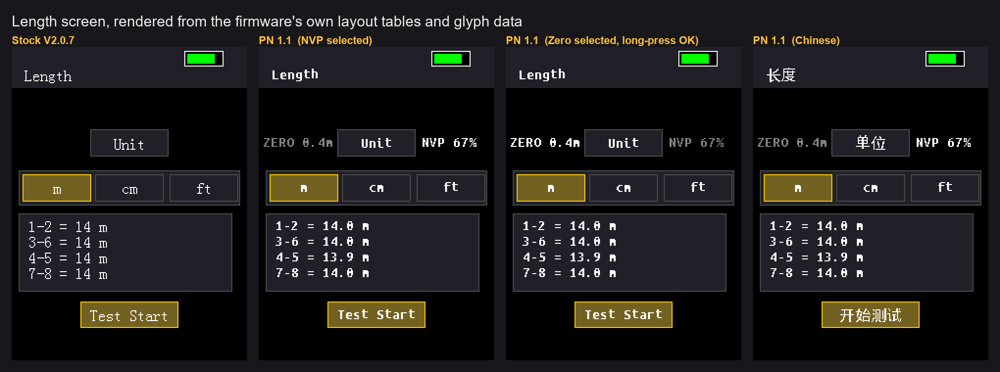
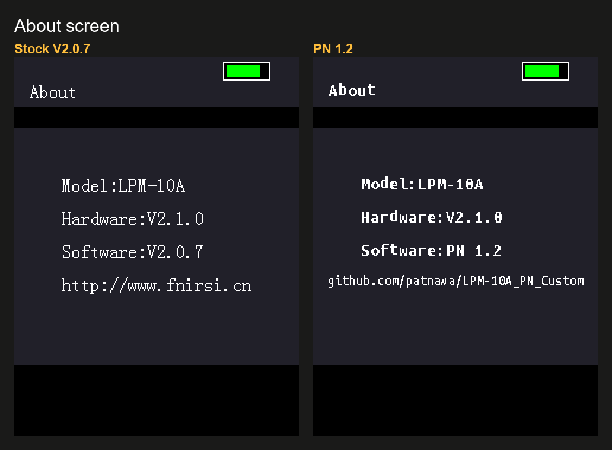
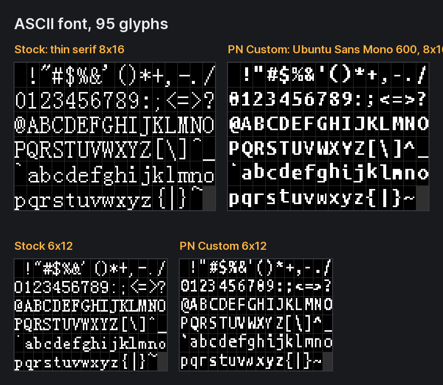
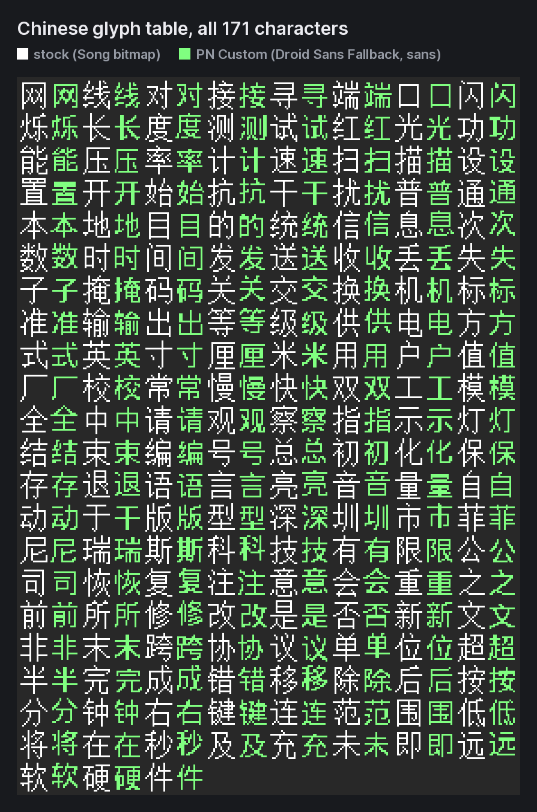
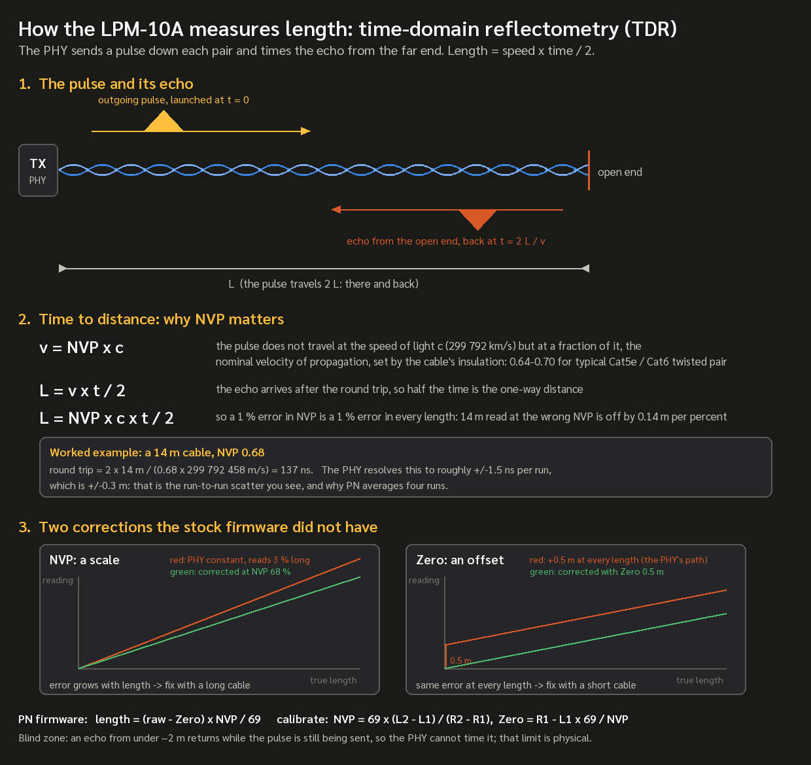
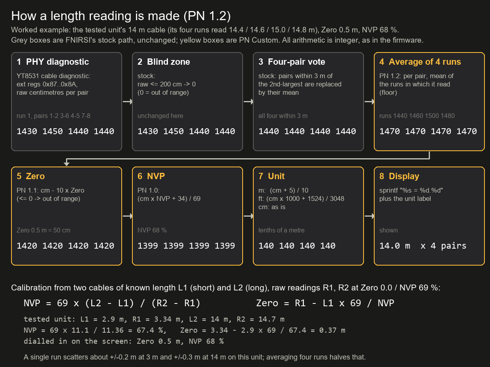
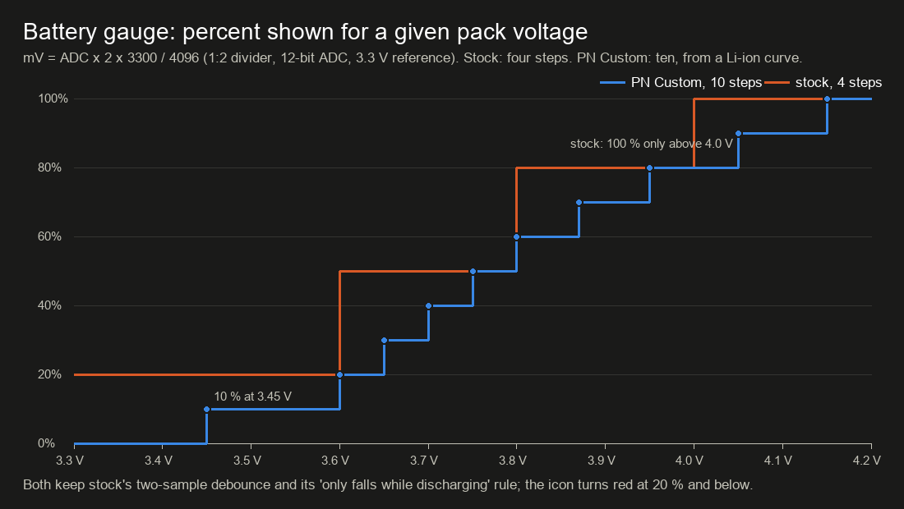
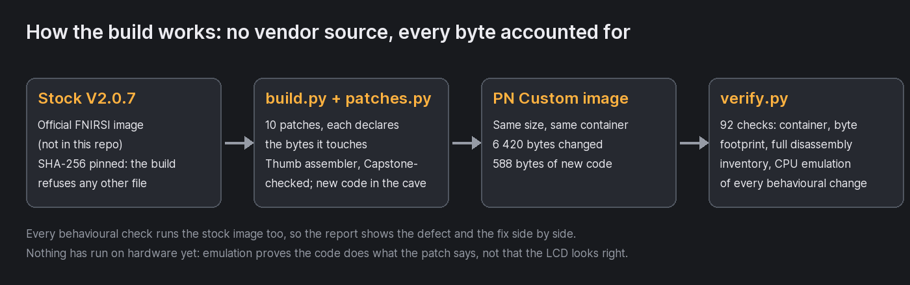
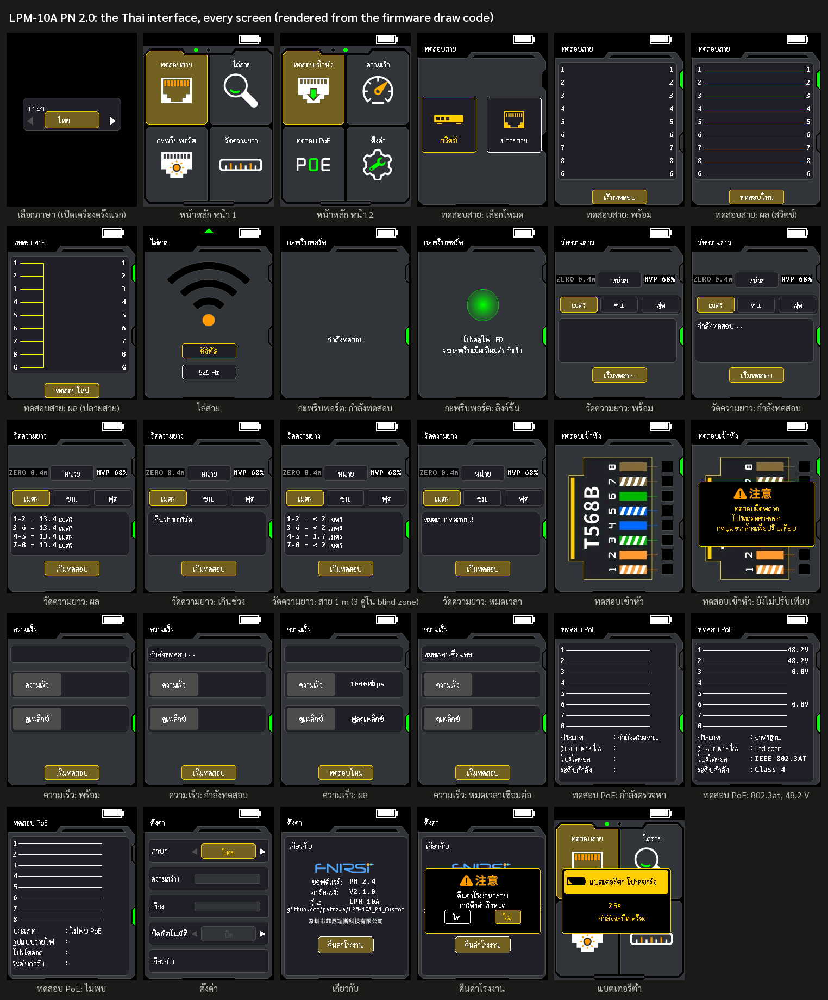

<div align="center">

# LPM-10A PN Custom Firmware

**PN 2.1: an unofficial, industrial-grade firmware for the FNIRSI LPM-10A network cable tester,
built by patching the official V2.0.7 image, proving every change by CPU emulation, and
validated on a real unit: PN 2.1, complete Thai user interface included, passed every function
on hardware on 2026-09-18.**


[](https://github.com/patnawa/LPM-10A_PN_Custom/releases/latest)



</div>

---

> **Status: PN 2.1 passed every function on a real unit on 2026-09-18**: the Thai interface
> on every screen, the two Cable Test fixes (Back returns to the Switch / Far end choice; the
> red "Result error!!" is no longer hidden under the Test Retry button), and everything
> from PN 1.x (Zero 0.5 m / NVP 68 % read a 2.9 m cable right). Verified by emulation too:
> 181 checks, 56 screen states compared pixel for pixel. What still fails is the PHY's own
> limit, not the firmware: cables of about 2 m and under cannot be measured, see
> [Known limitations](#known-limitations).
> Flash at your own risk, and read [How to go back to stock](#going-back-to-stock) first.

## Why

The LPM-10A is a capable tester (Motorcomm YT8531 PHY, TDR length, PoE, wiremap) let down
by its firmware: length shown in whole metres, no cable calibration, a low-battery
shutdown armed by a single noisy ADC sample, an Auto-Off that cut cable-tracing sessions
short, a heap leak on every settings save, and the thin serif "dev-board" font.
There is no vendor source, so this project works on the shipped binary: it disassembles
it, adds code in an unused flash tail, re-assembles, and verifies the result in place.

## What changes

| Area | Stock V2.0.7 | PN Custom |
|---|---|---|
| Length display | whole metres ("55"), inches, cm forced on every screen entry | **m / cm / ft with one decimal** ("55.4"), unit remembered across power cycles |
| Cable calibration | none; the PHY's fixed constant | **Zero 0.0–2.0 m and NVP 50–99 %** on the Length screen, live redraw, saved; 0.0 m / 69 % = factory |
| Length stability | one CSD run shown as is (±0.3 m scatter at 14 m) | **four runs averaged per pair**; a test takes four times longer |
| Length result | a new reading inside the tolerance band was replaced by the previous cable's value | the measured value is always shown |
| Low battery | one sample < 3150 mV starts an uncancellable 30 s shutdown | needs 3 consecutive samples; cancels when the pack recovers ≥ 3250 mV |
| Battery gauge | 4 steps | 10-step Li-ion curve, red at ≤ 20 % |
| Auto Off | keeps counting while the SCAN tone or FLASH blink is running, so a trace ends with the unit switching itself off | held (and restarted) while a tone or blink session is active; unchanged elsewhere |
| Settings save | 204 bytes leaked per save | freed on both exit paths |
| Fonts | thin serif 8×16 ASCII, Song-style Chinese | **Ubuntu Sans Mono** (8×16, 6×12) for English; **Sarabun** 13 px cells for Thai; all open-licensed |
| Language | Chinese / English, picker on first boot | **ไทย / English** on every screen (PN 2.0); picker on first boot and after a factory reset; machine-translated English corrected |
| SCAN modes | labelled "Noiseless" and "Normal" | labelled **Digital** (the 0xB6B6 coded pattern the probe decodes) and **825 Hz** (a plain keyed tone for any analogue probe) |
| Cable Test | Back leaves the screen from every step; "Result error!!" is painted under the Test Retry button | **Back returns to the Switch / Far end choice** from the armed and result screens (PN 2.1); the error line sits above the button, which moved 9 px down |
| Identity | About screen reports `Software:V2.0.7` and `http://www.fnirsi.cn` | reports `Software:PN 2.1` and this repository's URL; the bootloader-facing image name is untouched |



Everything is also verified **correct and left alone** where stock was right: battery mV,
PoE mV, link speed/duplex decoding, the 2.54 inch constant, the auto-off table. Every
formula is written out below in [The maths, formula by formula](#the-maths-formula-by-formula);
the long form with addresses and verdicts is
[`LPM-10A/Firmware File/FORMULA-AUDIT.md`](LPM-10A/Firmware%20File/FORMULA-AUDIT.md).

## Fonts

The firmware has exactly three glyph tables. They were located, decoded (column-major
bitmaps; the Chinese strings are glyph indices, not GB2312), transcribed, and regenerated
in the same cells so no screen layout changes. In PN 2.0 the 171-glyph Chinese table
carries the Thai cells instead (see [Thai user interface](#thai-user-interface-pn-20));
the Droid Sans Fallback Chinese table below is what PN 1.x shipped and is still built by
`fonts.py`.

<div align="center">

</div>

<details>
<summary>All 171 Chinese glyphs, stock (white) beside PN Custom (green)</summary>
<div align="center">

</div>
</details>

## Install

The firmware file is attached to every release on the
[Releases page](https://github.com/patnawa/LPM-10A_PN_Custom/releases/latest), together with
`MOD-README.txt`; the same file lives in the repository under `LPM-10A/Firmware File/`.

1. Verify the download:
   ```
   certutil -hashfile LPM-10A-TX_PN2.1.bin SHA256
   13679b1edaba91f7e475acbb119491f9731fce794d68d9947772268ace1c11c6
   ```
2. Power the tester off. Hold **M + Power** until the firmware update screen appears.
3. Connect USB-C; a removable drive appears.
4. Copy [`LPM-10A-TX_PN2.1.bin`](LPM-10A/Firmware%20File/LPM-10A-TX_PN2.1.bin)
   onto that drive. Do not unplug during the update.
5. Long-press Power to shut down, then power on normally.

If the device refuses the file, rename it to exactly `LPM-10A-TX_V2.0.7_260610.bin` and copy
it again; some bootloaders match on the filename (the name stored inside the image is the
stock one for exactly this reason). This update does not touch the receiver (probe); the
receiver build below is a separate file with its own, still unconfirmed, procedure. Requires
V2.x.x hardware, like stock V2.0.7.

### First power-on checklist

Every item below passed on a real unit on 2026-09-18 (PN 2.1). For a second unit:

- Cable Test: choose Switch or Far end, OK to the wiremap layout, then Back: the choice
  comes back (not Home). Back once more: Home. The same from a result.
- A cable with a broken wire: the red "Result error!!" / "ผลลัพธ์ผิดพลาด!!" line is
  readable between the wiremap and the Test Retry button.

- Settings > Language (ภาษา): switch between `English` and `ไทย`; every screen follows.
- In Thai: walk through Home (both pages), Cable Test, SCAN, FLASH, Length (a result and an
  "Out of range"), QC Test, SPEED (a result), PoE, Settings, About and Factory Reset (answer
  ไม่). Nothing overlaps, every word is readable, tone marks and vowels sit where they
  should ([the expected pictures](docs/THAI-UI.md)).
- Length in Thai: "กำลังทดสอบ" with the dots to its right, then the four readings with
  เมตร / ซม. / ฟุต; unplug the cable for "เกินช่วงการวัด".
- Switch back to English: every screen is exactly as PN 1.3.
- Settings > About reads `Software:PN 2.1` and shows `github.com/patnawa/LPM-10A_PN_Custom`.
- Length screen shows `ZERO 0.0m` left of the Unit box and `NVP 69%` right of it; UP/DOWN
  change the white one, a long press of OK swaps which is white, and after a test the four
  readings follow.
- Leave the Length screen and return, then power-cycle: unit, NVP and Zero are kept.
- Measure two cables of different length back to back; the second must not repeat the first.
- A length test now takes about four times as long as before and repeated tests of the same
  cable agree to within about ±0.15 m at 14 m (they scattered ±0.3 m before).
- SCAN with the tone on for longer than Auto Off: the unit stays on and the probe still
  finds the tone.
- The battery icon shows intermediate levels while discharging.

### Going back to stock

Same procedure with the original `LPM-10A-TX_V2.0.7_260610.bin` from FNIRSI's official
V2.0.7 package ([fnirsi.com](https://www.fnirsi.com), support / downloads). FNIRSI's files
are not distributed here. The bootloader lives in a separate flash region that is never
touched, so the update screen stays reachable. The three settings bytes the mod uses (NVP,
unit, Zero) are bytes the stock firmware ignores.

## The science: why TDR needs NVP

<div align="center">

</div>

The tester measures length the way every cable tester does, by **time-domain
reflectometry**: the PHY (the Ethernet chip, a Motorcomm YT8531) launches a short pulse
down a pair and times the echo that comes back from the far end. An open end reflects the
pulse with the same polarity, a short with the opposite one, a properly terminated pair
(a switch port) reflects nothing at all, which is why the Length screen wants the far end
unplugged. The distance follows from the round-trip time:

```
L = v · t / 2              t   round-trip time of the echo
v = NVP · c                c   speed of light, 299 792 458 m/s
L = NVP · c · t / 2        NVP nominal velocity of propagation, a property of the cable
```

Nothing in the cable travels at *c*. The signal moves through the insulation around the
copper, and its dielectric slows it to a fraction of *c* called the **nominal velocity of
propagation**: about 0.64 to 0.70 for twisted pair, printed on the reel by good cable
makers and different for every jacket, gauge and manufacturer. Because NVP multiplies the
whole result, **every percent of NVP error is a percent of length error**: a 14 m cable
measured with the NVP one point too high reads 14.2 m. Professional testers therefore let
you set NVP or calibrate it on a cable of known length; stock's firmware used one fixed
constant inside the PHY (equivalent to 69 %) and offered no way to change it.

The PHY resolves the echo time to roughly ±1.5 ns per run, which at NVP 0.68 is ±0.3 m
(0.68 × *c* × 1.5 ns / 2). That is the run-to-run scatter measured on the bench, and the
reason PN runs the diagnostic four times and averages.

Two things in the tested unit's readings were not NVP:

- a constant **+0.5 m at every length**, the delay through the PHY's own front end and the
  connector before the pulse reaches the cable. A factor cannot remove a constant, so PN 1.1
  added **Zero**, an offset subtracted before the NVP scaling;
- the **blind zone**: below about 2 m the echo returns while the outgoing pulse is still
  being launched, and the timer cannot separate the two. That limit is physical; stock
  reports "Out of range" there and PN keeps it (an experimental build lowers the cut-off to
  0.5 m only to collect raw readings).

So the PN formula is `length = (raw − Zero) × NVP / 69` with both constants yours to set,
and the two-cable calibration below solves for them exactly. The same formula, with the
addresses and every intermediate value, is written out in
[The maths, formula by formula](#the-maths-formula-by-formula).

## Length calibration: Zero and NVP

The PHY's TDR reading contains two errors, and the hardware test measured both on one
unit: a fixed **offset** from the chip's own signal path and a **scale** from the cable's
velocity of propagation. At NVP 69 % a 2.9 m cable read 3.1–3.5 m in one session and,
converted back from a later session at 66 %, 3.45–3.66 m; a 14 m cable read 14.4–15.0 m.
That is an offset of roughly +0.4 to +0.6 m with a scale within a few percent, on top of
the PHY's ±0.2 m reading-to-reading spread. A factor (NVP) alone cannot remove an offset,
which is why PN 1.1 adds Zero:

```
length = (raw − Zero) × NVP / 69       Zero 0.0–2.0 m in 0.1 m steps, NVP 50–99 %
```

On the **Length** screen `ZERO 0.0m` is shown left of the Unit box and `NVP 69%` right of
it. UP / DOWN (hold for auto-repeat) change the value drawn in white; **hold OK for about a
second** to swap which one is white (a short press still starts a test). Every change
redraws the four readings at once, no re-measure needed. Both values are saved with the other settings at power-off; Factory Reset returns
to 0.0 m / 69 %.

To calibrate, use two cables of known length, one short (about 3 m) and one long (15 m or
more):

1. Measure the short cable. Long-press OK to select Zero, then UP / DOWN until it reads
   right.
2. Measure the long cable. Long-press OK to select NVP, then UP / DOWN until it reads right.
3. Re-check the short cable; adjust Zero once more if needed.

On the unit measured, Zero 0.5 m and NVP 68 % read the 2.9 m cable right; every unit and
cable batch will differ, which is the point of having the controls. The remaining
reading-to-reading scatter (±0.3 m at 14 m) is the PHY's, not the calibration's; PN 1.2
averages four runs per pair to halve it. Below about 2 m the PHY's
value is unreliable: a 1 m cable came back as 2.4 m or as *Out of range*. The stock blind
zone (raw readings of 2 m or less are discarded, before the Zero is subtracted) is kept, so
short readings are not to be trusted.

Integers only, rounded; 69 % and 0.0 m are the PHY's own calibration, so at the factory
values the reading is exactly stock's centimetre value.

## The maths, formula by formula

Everything the tester computes, with the exact integer arithmetic the firmware runs.
Stock formulas were recovered by disassembly and checked by running the firmware's own
code under emulation; the patched ones are the code in `sdk/patches.py`. The long form
with addresses and verdicts is
[`LPM-10A/Firmware File/FORMULA-AUDIT.md`](LPM-10A/Firmware%20File/FORMULA-AUDIT.md).

### Cable length



The tester does not time pulses itself. It runs the Cable Status Diagnostic built into
the Motorcomm YT8531 PHY and reads four results in centimetres, one per pair
(1-2, 3-6, 4-5, 7-8). From there:

| step | who | formula | notes |
|---|---|---|---|
| 1. Diagnostic run | stock | ext regs 0x80 = 0x9240, 0x97 = 0x5600, 0xA000 = 0, 0x98 = 0xB0A6; clear bit 15 of 0x27; BMCR soft reset; 0x80 bit 0 = start; poll 0x84 bit 15; read 0x87–0x8A | one run, PHY-timed |
| 2. Blind zone | stock | `raw ≤ 200 cm → 0` | 0 means "out of range" for that pair |
| 3. Four-pair vote | stock | tolerance `tol = 100 cm` below 10 m, `300` below 100 m, `500` below 200 m, else `600`; reference = the second-largest value (the third if the top two are equal); pairs within `tol` of it are replaced by their mean, the rest keep their own value, and two outliers within `tol` of each other are averaged as a second cluster | a consensus filter, not a formula; runs once per diagnostic run |
| 4. Run average | **PN 1.2** | `mean_i = floor(Σ runs_i / n_i)` over the 4 runs, counting only runs where pair *i* read non-zero; `n_i = 0 → 0` | halves the per-run scatter (±0.2 m at 3 m, ±0.3 m at 14 m on the tested unit); the 20 s timeout restarts per run; replaces stock's single retry |
| 5. Zero | **PN 1.1** | `cm0 = cm − 10 × Zero`; `cm0 ≤ 0 → 0` | Zero in 0.1 m steps, 0.0–2.0 m, settings byte 0xC5; a byte above 20 (unset) = no offset |
| 6. NVP | **PN 1.0** | `cm' = (cm0 × NVP + 34) / 69` | 50–99 %, settings byte 0xA6; any byte outside that range (0 = factory) is the identity, and so is 69 % inside it |
| 7. Unit | **PN 1.0** | m: `(cm' + 5) / 10` tenths · cm: `cm'` · ft: `(cm' × 1000 + 1524) / 3048` tenths | integer division, rounded; a pair only 1–4 cm above the Zero rounds to 0.0 and counts as out of range |
| 8. Display | **PN 1.0** | `sprintf("%s = %d.%d")` for m and ft, `"%s = %d"` for cm; "Out of range" only when all four are 0 | the firmware's own `sprintf` |

Why the two calibration controls: the PHY's number is `v_assumed × t / 2`, where the time
includes the chip's internal path. So the reading is `k × length + offset`. NVP fixes `k`
(the cable's velocity relative to what the PHY assumes), Zero fixes `offset` (the internal
path). With two cables of known length L₁ (short) and L₂ (long) and their raw readings R₁,
R₂ taken at Zero 0.0 / NVP 69 %:

```
NVP  = 69 × (L₂ − L₁) / (R₂ − R₁)
Zero = R₁ − L₁ × 69 / NVP
```

Tested unit: L₁ = 2.9 m read 3.34 m, L₂ = 14 m read 14.7 m → NVP ≈ 67 %, Zero ≈ 0.4 m;
dialled in on the screen it settled at **Zero 0.5 m, NVP 68 %**, which is within the
PHY's per-run scatter (±0.2 m at 3 m, ±0.3 m at 14 m). Worked example with those settings
and the diagram's run mean: 1470 cm → 1470 − 50 = 1420 → (1420 × 68 + 34) / 69 = 1399 →
(1399 + 5) / 10 = 140 → **14.0 m**.

Stock had none of steps 4–6: its only re-run was a single retry when the four post-vote
pairs were not all identical, showing that second run as is. It showed whole metres
(`cm/100 + (cm % 100 ≥ 50)`), offered inches (`cm / 2.54`, truncated) instead of feet,
forced centimetres on every screen entry, and kept the previous cable's result whenever
`|new − previous| < tol(new) − 1` (up to 2.98 m at 50 m, 0.98 m below 10 m: the "sticky"
bug, removed by `length-no-sticky`).

### Battery



| quantity | formula | notes |
|---|---|---|
| Pack voltage | `mV = raw × 2 × 3300 / 4096` | 12-bit ADC, 3.3 V reference, 1:2 divider; 1 LSB ≈ 1.6 mV; unchanged |
| Percent, stock | `> 4000 → 100`, `> 3800 → 80`, `> 3600 → 50`, else `20` | four values, and the icon only drew those four |
| Percent, PN Custom | `≥ 4150 → 100, ≥ 4050 → 90, ≥ 3950 → 80, ≥ 3870 → 70, ≥ 3800 → 60, ≥ 3750 → 50, ≥ 3700 → 40, ≥ 3650 → 30, ≥ 3600 → 20, ≥ 3450 → 10, else 0` | single-cell Li-ion open-circuit curve; icon draws `pct / 10` segments, red at ≤ 20 % |
| Gauge debounce | a new percentage is shown after two consecutive samples agree, and it only falls while discharging (it rises only on the charger) | stock rule, kept |
| Low-battery shutdown, stock | one sample `< 3150 mV` (sampled once a second, skipped while a test runs, armed only with no charger connected) starts a 30 s countdown; only a charger cancels it | one noisy sample could switch the unit off |
| Low-battery shutdown, PN Custom | three consecutive samples `< 3150 mV` (≥ 3 s) arm it; cancelled, checked once a second, when the pack reads `≥ 3250 mV` again or the charger is connected | 100 mV hysteresis |
| Charger state | PC10 low = charging, PA15 low = charge complete | GPIO, unchanged |

### PoE

| quantity | formula | notes |
|---|---|---|
| Voltage | `mV = (max − min of 4 ADC channels) × 3300 × 40 / 4096` | 1:40 divider; thresholds 2 V idle, 4 V, 40 V "PoE present"; truncated to 16 bits (harmless below 65 V) |
| Span / polarity | pair differences compared with `0.7 × spread` (spread > 372 counts) or `0.9 × spread` | vendor tuning → end-span / mid-span / both |
| Class | two comparator inputs, PA6 and PA7: both high → 3, PA6 only → 4, PA7 only → 6, both low → 8 → 802.3af / at / bt / bt | one bar segment per class step; no wattage arithmetic |
| Stability | the last 200 entries of a 2048-byte ring of `mV >> 8`, "unstable" if max − min > 40 000 | can never trigger (a byte spread is ≤ 255); dead code, documented, not patched |

### Link, wiremap, housekeeping

| quantity | formula | notes |
|---|---|---|
| Link speed | PHY reg 0x11 bits 15:14 = 00 / 01 / 10 → 10 / 100 / 1000 Mbps (11 = error) | 20 s auto-negotiation wait |
| Duplex | reg 0x11 bit 13 = 1 → full, 0 → half | |
| Wiremap | per wire: select via a 4-bit mux (PE1/PE2/PE3/PC3), zero TIM8's counter (external clock on PC7), wait 10 ms, read the count; `|count − baseline| < 7 → open`, `count > baseline → "init again"`, else connected | baseline = the eight counts stored by the wiremap Init action, kept in the settings block (offset 0x90) and reloaded at boot |
| Auto Off | `{0, 300, 600, 900}` s = OFF / 5 / 10 / 15 min, counter reset on every key event and after every Length / Speed result | **PN Custom** also holds it while a SCAN tone or FLASH blink session runs |
| Backlight dim | `setting × 200 ms` of inactivity | unchanged |
| Watchdog | IWDG prescaler /32, reload 0xFFF ≈ 3.3 s at 40 kHz | a hard fault reboots the unit in ~3.3 s |

### Receiver (probe), for reference

The probe's own firmware is analysed in [`docs/RX-AUDIT.md`](docs/RX-AUDIT.md). The numbers
that matter for the tone function: the transmitter keys its carrier in 5.05 ms slots
(TIM2 at 72 MHz / 72 / 101) in the 16-slot pattern 0xB6B6; the probe samples once per
5.00 ms (TIM5 at 40 kHz, 200 ticks) and needs two exact 16-bit matches within 240 ms.
Its battery is `mV = raw × 6600 / 4096`, LED at ≤ 3579 mV, cleared at ≥ 3621 mV, critical
below 3280 mV; the receiver build makes that critical state recoverable at ≥ 3400 mV.

## How it is built and verified

<div align="center">

</div>

The build input is FNIRSI's own image, which is **not in this repository**: download the
official V2.0.7 package, unzip it, and put `LPM-10A-TX_V2.0.7_260610.bin` either in
`LPM-10A/Firmware File/`, in a folder named `LPM-10A_FNIRSI_originals` next to the
repository, or anywhere with `LPM10A_STOCK` pointing at it. Every tool checks its SHA-256
(`29081ccbbd929a884c7c81fb309aa2894ce2ab84e061918538b3ead8e632940b`) and refuses anything else.

```bash
cd "LPM-10A/Firmware File/sdk"
pip install capstone unicorn        # pillow + pymupdf only to rebuild the fonts
python test_thumb.py                # assembler self-test against Capstone
python build.py --list              # the patch set
python build.py                     # dry run: every byte it would change, disassembled
python build.py --write             # emit LPM-10A-TX_PN2.1.bin
python verify.py                    # 181 checks
```

`build.py --only a,b` builds a subset; every patch is independent. `build.py` refuses to
run on anything but the pinned stock image.

What `verify.py` proves, section by section:

| § | check | how |
|---|---|---|
| 1–3 | container, byte footprint, full disassembly inventory | any byte changed without being declared by a patch fails |
| 4–5 | auto-off hold, factory defaults | a key event through the stock dispatcher (proves stock already resets on keys); the 1 s housekeeping in SCAN/FLASH with the session flags on and off |
| 6–7 | unit conversion, on-screen text | 36 vectors; the text comes out of the firmware's own `sprintf` |
| 8 | sticky result, run averaging | 50 m previous, 52 m readings: stock keeps 50, mod stores 52; four simulated CSD runs through the real re-run block: per-pair means, out-of-range runs left out, stale accumulator ignored, registers and stack intact; stock's single retry for comparison |
| 9–10 | battery debounce and gauge | sample sequences, ADC + GPIO for the cancel path, 18-point curve |
| 11 | heap leak | both exit paths trapped at `vPortFree` |
| 12–16 | Zero + NVP | 513 arithmetic vectors including the measured unit's numbers, key hook (clicks, repeat, clamps, OK long press, other screens), message routing, both rendered texts with their colours, screen-entry draw, Factory Reset defaults compared with stock byte for byte |
| 17 | fonts | the firmware's own glyph drawers render all 361 glyphs; pixels must equal the designed bitmaps |
| 18 | identity | the version strings through the firmware's `sprintf`; the container name is byte-identical to stock; the SCAN labels and the About URL line drawn through the stock code with `gui_blit` trapped |
| 19 | Thai UI | the cell table, every one of the 64 string stubs resolved through the redirect table, the hook table, the three routines byte-identical to their assembled source, the drawer unit test; then **all 56 screen states drawn by the built firmware in Thai compared pixel for pixel with the design model, all 56 in English compared with the same build without the Thai patch**, and every Thai string drawn at least once |
| 20 | Cable Test Back | the key dispatcher with action 7 in every function state, mod and stock: only CABLE_TEST with the layout shown re-enters the screen; everything else keeps stock's target |

Each behavioural check runs the stock image too, so the report shows the defect and the fix
side by side. The SDK internals (symbol database, assembler, cave allocator, font tool) are
documented in [`LPM-10A/Firmware File/sdk/README.md`](LPM-10A/Firmware%20File/sdk/README.md).

## Repository layout

```
LPM-10A/
  Firmware File/
    LPM-10A-TX_PN2.1.bin              PN Custom image (the build output)
    LPM-10A-TX_V2.0.7_260610.bin      stock image: NOT included, put FNIRSI's copy here to build
    MOD-README.txt                    change list, hashes, flashing, checklist
    FORMULA-AUDIT.md                  every measurement formula, with verdicts
    sdk/                              the transmitter toolkit: patches, assembler, verifier, fonts
    sdk/thai/                         the Thai UI: cell font, drawers, wording, screen emulator, mock-ups
    APP_LPM-10RX_PN1.0.bin            receiver image (battery fix); flashing procedure unconfirmed
    RX-README.txt                     receiver change list, hash, warnings
    rx-sdk/                           the receiver toolkit: patches, verifier, disassembler
docs/img/                             the images on this page (screens are rendered from the firmware's own layout tables and glyphs)
```

## Receiver (probe)

The probe has its own firmware, audit and toolkit:
[`docs/RX-AUDIT.md`](docs/RX-AUDIT.md) and
[`LPM-10A/Firmware File/rx-sdk`](LPM-10A/Firmware%20File/rx-sdk/README.md). The first receiver
build, [`APP_LPM-10RX_PN1.0.bin`](LPM-10A/Firmware%20File/APP_LPM-10RX_PN1.0.bin), fixes one
thing: a critical-battery shutdown that could not be cancelled once a single reading dipped
below 3280 mV. It is emulation-verified (25 checks) and **must not be flashed yet**: FNIRSI
does not document how the receiver enters its update mode, and the way back to stock has to
be confirmed first. Details in
[`LPM-10A/Firmware File/RX-README.txt`](LPM-10A/Firmware%20File/RX-README.txt).

## Thai user interface (PN 2.0)

The second language of the tester is Thai instead of Chinese, on every screen. Sarabun
(SIL OFL) is rendered into 16 × 16 one-bit cells, one per consonant cluster (118 cells,
Latin letters and digits in the same face), and drawn proportionally by a replacement text
drawer that keeps the stock drawers' signatures, so no coordinate in the firmware changes.
Every Chinese string slot became a 3-byte redirect to the Thai text in the freed glyph
slots; the four messages stock only had in English got Thai versions through a hook on
`gui_blit` that is inert in English. English is byte-for-byte PN 1.3.

The wording of every string, how it was built and how it is verified are in
[docs/THAI-UI.md](docs/THAI-UI.md); the tooling is `sdk/thai/`. The pictures below are
not mock-ups: they are what the firmware draws (`verify.py` §19 proves the built image
produces exactly these pixels), and the whole interface passed on a real unit on 2026-09-18
(PN 2.0 and PN 2.1).



## What next

The prioritised list of what to test on hardware and what to build after that is in
[`docs/ROADMAP.md`](docs/ROADMAP.md).

## Known limitations

Things that need vendor source or hardware, so they are documented rather than patched:

- Cables of about 2 m and under read "Out of range" (the PHY's TDR blind zone: the echo
  returns before the pulse has finished, so the YT8531 reports nothing usable; confirmed on
  hardware with a 1 m cable on PN 1.3). This is why the Length screen cannot tell which pair
  of a short patch cable is broken; the Cable Test (wiremap) screen can. An experimental
  build that lowers stock's 2.0 m cut-off to 0.5 m exists to collect raw readings, see
  [`experimental/README.md`](LPM-10A/Firmware%20File/experimental/README.md).
- FreeRTOS queue calls are made from interrupt handlers in stock; the likely cause of
  rare lockups. The independent watchdog (≈3.3 s) is what recovers from a hard fault.
- The PoE "unstable supply" check compares byte data against 40 000 and can never trigger.
- NVP and Zero are on the Length screen, not in Settings: the five Settings rows already fill the
  320-px screen.
- The update container has no CRC or signature; that is what `verify.py` is for.

## Licences and credits

- Tooling, patches and documentation: MIT (see [LICENSE](LICENSE)).
- FNIRSI's firmware files are not redistributed here; the build takes the official V2.0.7
  image as its input and the flashing instructions send you to FNIRSI for it.
- Fonts: Ubuntu Sans Mono under the Ubuntu Font Licence 1.0; Sarabun (the Thai interface)
  under the SIL Open Font License 1.1; Droid Sans Fallback (the PN 1.x Chinese table) under
  the Apache License 2.0. All three permit redistribution of the rasterized glyphs.
- Disassembly with [Capstone](https://www.capstone-engine.org/), emulation with
  [Unicorn](https://www.unicorn-engine.org/).

*Not affiliated with or endorsed by FNIRSI.*
