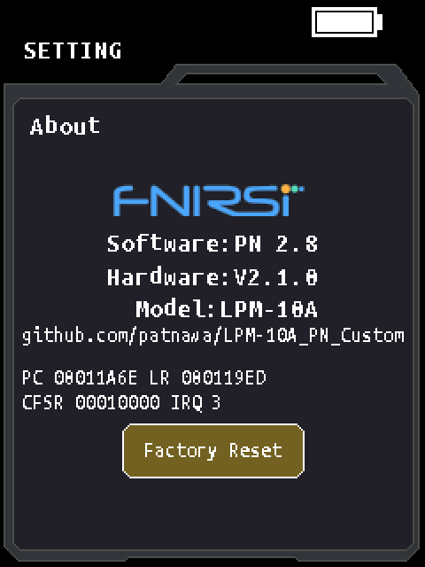
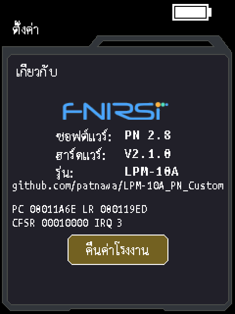

# TX PN 2.8 / RX PN 1.3 roadmap implementation

The requested bug fixes and Ideas 1–7 were assembled and CPU-tested against
the SHA-pinned vendor images. The owner subsequently reported "test pass on
device" and requested publication on 2026-09-19. The TX PN 2.8 release and
experimental RX PN 1.3 prerelease preserve the tested roadmap binaries exactly.
This is an owner-reported general functional pass, not a detailed edge-case,
range/noise, ISR-timing or multi-revision test matrix. The older PN 2.7 TX and
PN 1.2 RX binaries are unchanged. Release notes:
[TX PN 2.8](releases/v2.8.md), [RX PN 1.3](releases/rx-v1.3.md).

## Implemented behavior

| Request | Implementation and verification |
|---|---|
| Bug 1 / Idea 1: partial zero | Zero takes precedence over partial numeric formatting. Every pair, count 0–4 and unit uses `< 2`, `< 200` or `< 7`; `OVR` still takes precedence. Nonzero partial results retain `~`. |
| Bug 2 / Idea 3: ISR queue calls | All ten application callback sites in the actual SysTick hook publish distinct pending bits. A new priority-2 service task drains them every scheduler tick. Publication and exchange preserve PRIMASK; queue/log/battery callbacks execute after the mask is restored. Ordinary 10/500/1000/2000 ms dispatch counts are tested. |
| Bug 3 / Idea 6: false watchdog liveness | TX TIM2 consumes a service-task heartbeat after scheduler startup. RX TIM1 no longer reloads IWDG; completed main-loop iterations reload it. Timer-only execution cannot keep the RX watchdog alive. |
| Bug 4 / Idea 7: recent signal | RX resets idle time whenever either the existing beep/key byte or `signal_recent` is nonzero. After both expire, a full idle interval is available. Physical power-key and battery shutdown remain effective. |
| Bug 5: ADC ownership/completion | RX masks interrupts from channel selection through DAT read, clears stale ENDC/ENDCA/STR before SWSTART, polls ENDC, then restores the incoming mask. The 128-poll timeout requests reset instead of returning stale or fabricated battery data. Tests use actual channel-configuration instructions and modeled delayed peripheral completion. |
| Bug 6 / Idea 5: calibration persistence | The actual system-state setter saves changed NVP, Zero or unit when leaving Length for another active screen. A dedicated 204-byte staging buffer avoids the vendor's unchecked allocation. Task scheduling is suspended during the flash transaction; erase/program return codes and readback are checked, and flash is locked/scheduling resumed on failure. Unchanged settings cause no write. |
| Bug 7: display latch tear | The 16-byte PoE copy masks interrupts for the four load/store pairs and restores PRIMASK. This prevents the higher-priority PoE task from preempting the GUI halfway through this copy. Tests check every destination write occurs while masked. |
| Idea 2: digital strength | Accepted detections use contrast to choose high: 30 ms on / 30 off; medium: 50/50; low: 50/100 (150 ms nominal period). Boundaries are contrast >1000, 500–1000, and 192–499. Both exact and tolerant correlation paths retain their acceptance rules. One existing ZI padding byte, `0x2000005D`, stores the repeat gap. |
| Idea 4: crash diagnostics | HardFault, MemManage, BusFault and UsageFault vectors enter a stackless recorder. It selects MSP/PSP from EXC_RETURN, accounts for extended FP frames, avoids stack reads after stacking faults or invalid SRAM/alignment, commits a retained RAM signature last, and requests reset. About shows PC/LR and CFSR/exception number in English and Thai. |

The unreleased TX base candidate (`LPM-10A-TX_PN2.8.bin`) contains only the new partial-zero
and PoE-copy fixes on top of the previous default patches. Use the roadmap
profile and released `LPM-10A-TX_PN2.8-roadmap.bin` for all requested TX enhancements.
RX roadmap edits stay inside the
26,152-byte image; vectors, device binding, version page, clock setup and timer
periods are unchanged. Its vendor-facing version remains `3.0.0` for compatibility.

## Corrections to the submitted audit

- TX's SysTick application hook starts at `0x0801BC70`; `0x0801BD10` is an
  interior instruction. TIM2 is at `0x08018370`, not `0x080142C8`.
- Task queue APIs in an ISR are unsupported, but their presence does not prove
  that every call corrupts nesting or that a full queue must HardFault. The
  observed send sites pass zero wait. The alleged exact connection to FNIRSI's
  shutdown changelog was not established. FreeRTOS explains why interrupt
  handlers need ISR-specific APIs and mask handling in its
  [critical-section guidance](https://www.freertos.org/FreeRTOS_Support_Forum_Archive/July_2015/freertos_why_taskENTER_CRITICAL_taskEXIT_CRITICAL_can_not_be_used_in_ISR_c919accaj.html).
- Continuous digital beeps already reset idle time; their short gaps cannot
  accumulate five minutes of idle. A 2,000-tick replay of PN 1.2 demonstrates
  this. Checking `signal_recent` is additional protection for recorded detection
  without an active beep, not evidence that the stated continuous-tone failure
  happened. Also, `0x20000104 - 0x2000006C` is `0x98`, not `0xA0`.
- Missing EOC polling establishes a race, not that every read necessarily
  returns exactly the previous conversion. Actual timing determines that.
  Nations' [N32L40x user manual](https://www.nsing.com.sg/uploads/MCUProducts/N32L40x/Chip_Documentation/User_Manual/EN_UM_N32L40x_Series_User_Manual.pdf),
  printed page 369, identifies ENDC as ADC_STS bit 1. No STM32 register layout
  was assumed for the patch.
- `0x08012F48` belongs to FLASH handling, not a Length-exit function. Autosave
  instead intercepts `APP_HOME_set_sysState` at `0x0800F77C` while the old screen
  is still known. Loss of unsaved RAM settings restores the last persisted
  settings, which need not be factory defaults.
- `flags |= bit` is not inherently atomic. Both producer read/modify/write and
  consumer exchange are protected. Likewise a fault handler cannot always read
  the exception frame from MSP.

## Validation

The owner reported the TX/RX candidates passed on-device testing on 2026-09-19.
The specific follow-up checks below were not individually enumerated.

- TX base: full `verify.py` passes, including both-language GUI regressions,
  SCAN, FLASH, length/calibration/overflow and the added partial-zero matrix.
  The existing 12 audit tests and assembler round-trip suite pass.
- TX roadmap: 13 test groups pass, covering emitted-image identity, every
  SysTick callback condition, normal cadences, event coalescing/new arrivals,
  mask restoration, task creation/failure, watchdog gating, 112 state/change
  combinations, flash error handling/readback, MSP/PSP/basic/FP exception frames,
  retained records, real About branches and PoE copy protection.
- RX roadmap: nine test groups pass, including the existing digital and
  key/power/control suites, 2,048 seeded noise windows and 640 synthetic
  phase/drift/noise windows, three beep levels and repeats, deadline boundaries,
  timer-only watchdog behavior, all four ADC channels, delayed completion with
  both incoming masks, timeout/reset, image ownership and unchanged binding.
- RX PN 1.2's existing 97 checks and five image-tool tests still pass. The RX
  roadmap boot model retains the stock 64 MHz core and timer configuration.
- English and Thai crash screens were rendered with the real firmware draw
  paths and visually checked. The fault rows replace the old company-text area.




Emulation stubs hardware and RTOS services. It does not model a complete
preemptive FreeRTOS scheduler or prove analog timing/electrical performance.

## Boundaries requiring hardware follow-up

1. The TX heartbeat proves service-task/scheduler progress, not the health of
   every independently blocked task. Event bits intentionally coalesce repeated
   occurrences during a worker stall; elapsed periodic callbacks are not replayed
   as a burst. The task adds 512 stack words plus the vendor TCB allocation.
2. ADC interrupt masking changes latency. Measure the longest transaction and
   confirm TIM5 sampling and audio timing on hardware, including battery/AGC
   activity. The timeout is a poll budget, not a measured microsecond deadline.
3. Strength thresholds are provisional ADC contrast levels, without AGC
   normalization. They do not establish Fluke-equivalent cable discrimination or
   range. Validate contact, adjacent-cable bleed, noise and gain transitions.
4. Autosave protects changes **after leaving Length**. A battery cut while still
   editing, or during the single-page erase/program operation, can still lose
   settings. This change does not implement a power-fail-safe flash journal.
   A failed save returns failure internally and is eligible for another attempt
   on a later Length exit; it does not add a GUI save-error indicator.
5. The crash record is outside the application's zero-initialized RAM. Retention
   across the device's bootloader/reset path still needs verification. It is
   not retained across power loss. About keeps showing the last valid record.
6. The PoE patch prevents interruption of the display copy; it does not make
   sequential physical ADC acquisitions simultaneous or validate classification.
   Vendor pair consensus, discarded PHY fault classifications, and nominal
   TX/RX slot mismatch remain separate measurement limitations.

## Reproduce

From `LPM-10A/Firmware File/sdk`:

```text
python test_thumb.py
python -m unittest test_audit -v
python build.py --write
python verify.py
python build.py --roadmap --write
python -m unittest test_roadmap -v
```

From `LPM-10A/Firmware File/rx-sdk`:

```text
python build.py --roadmap --write
python -m unittest test_roadmap test_image -v
python verify.py --reliability
python boot_emu.py ../experimental/APP_LPM-10RX_PN1.3-roadmap.bin
```

Use the dedicated roadmap tests for roadmap images; the existing verifiers
deliberately compare against their own base/release profiles. File sizes and
SHA-256 digests are recorded in
[`ROADMAP-MANIFEST.json`](../LPM-10A/Firmware%20File/experimental/ROADMAP-MANIFEST.json)
and [`ROADMAP-SHA256SUMS.txt`](../LPM-10A/Firmware%20File/experimental/ROADMAP-SHA256SUMS.txt).
