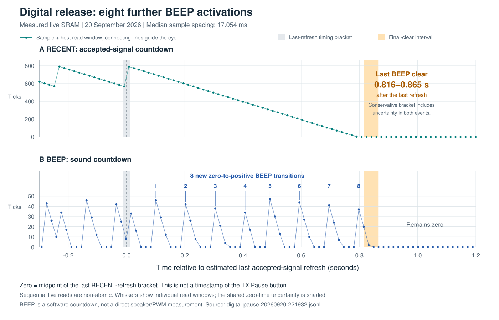

# Live RX Digital release and runtime layout

**การอ่าน RAM จากเครื่องจริงพบว่าตัวโพรบยังสั่งบี๊บซ้ำอีก 8 ครั้งหลังการยืนยัน
สัญญาณครั้งสุดท้าย และตัวนับเสียงหยุดในอีกประมาณ 0.82–0.86 วินาที ขณะนาฬิกา
ทั้งสองทำงานตามอัตราปกติ นอกจากนี้ตำแหน่งตัวแปรใน RAM ของเครื่องจริงต่างจาก
ไฟล์ V3.0.0/PN ที่ใช้พัฒนา จึงต้องแยกเฟิร์มแวร์ที่เครื่องรันจริงออกจากไฟล์
ที่เลือกอัปเดต ยังยืนยันชื่อเวอร์ชันที่ติดตั้งไม่ได้**

## Capture and timing limits

The owner confirmed Digital reception before this read-only capture and was
asked to pause TX during it. The trace contains the transition to quiet input
and final release, but it does **not** contain a synchronized TX button event.
Reported intervals below are relative to observed receiver state, not an exact
physical TX Pause timestamp.

Source: `C:/Users/Alpha/Desktop/LPM-10RX-SWD-2026-09-20/digital-pause-20260920-221932.jsonl`.
SHA-256: `b925f22b2a3d0c368e97c2296b763bb66329ec478ac04383d66ea9bd5ad686b3`.
There are 2,348 rows over 40.0066 seconds, with median row spacing 17.054 ms
(range 16.582–17.838 ms). RX was powered from its battery before attaching
GND/SWCLK/SWDIO, without the STLink supply wires.

The [capture routine](experiments/rx_swd_runtime_capture.py) reads
`0x20000048..6F`, then `0x200000EC..10F`, while the CPU continues running.
State reads occur between `begin_s` and `state_end_s`; the second block is read
between `state_end_s` and `end_s`. These reads are not atomic. The analysis uses
the retained hexadecimal bytes, **not** the original capture's incorrect
V3.0.0-based `gap`, `grade`, `recent` or `gate_state` labels.

Reproducible [offline analysis](experiments/rx_live_digital_release_audit.py)
and [machine-readable results](experiments/results/rx-live-digital-release-2026-09-20.json)
require no hardware connection:

```powershell
python docs/experiments/rx_live_digital_release_audit.py "C:/Users/Alpha/Desktop/LPM-10RX-SWD-2026-09-20/digital-pause-20260920-221932.jsonl" --out docs/experiments/results/rx-live-digital-release-2026-09-20.json
```

## Observed state layout

The following meanings are inferred from actual changing values and independent
relationships. They are not recovered declarations from the protected code.
Addresses use the `0x20000000` SRAM base.

| Field | Stored V3.0.0 / PN location | Observed device location | Evidence |
|---|---|---|---|
| Mode | `+48` | `+48` | Zero throughout owner-confirmed Digital capture |
| Repeat gap | `+5A` | `+5C` | Counts 50 down to zero between BEEP activations |
| Digital sample index | `+5B` | `+5D` | Repeated 0..47 sweeps; 168 wraps |
| Analog sample index | `+5C` | Probably `+5E` | Shifted-layout inference only; no Analog activity in this trace |
| Five sensitivity ADC samples | `+5E..67` | `+60..69` | Trimmed mean equals `+6A` in all 2,348 rows |
| Raw sensitivity gate | `+68` | `+6A` | 1,293..1,297, exactly matching that trimmed mean |
| Gate divided by 580 | `+6A` | `+6C` | Exactly `floor(gate/580)=2` in all 2,348 rows |
| Recent accepted-signal countdown | `+6C` | `+6E` | 0..800, periodic refresh then one-tick decay |
| 64-sample buffer | `+6E..ED` | Probably `+70..EF` | Inferred from the surrounding fields; whole buffer not captured here |
| Digital subsample position | `+EE` | `+F0` | Repeated 0..10 progression |
| Five raw tone subsamples | `+F0..F9` | `+F2..FB` | Five varying ADC-sized values, with tone-to-quiet transition |
| TIM1 / TIM5 interrupt counters | `+FC` / `+100` | Same | Continuous increments at approximately 1 kHz / 40 kHz |
| BEEP countdown | `+10C` | Same | Repeated 0..50 countdowns |

This is consistent with a two-byte shift beginning before the repeat-gap field
and ending before the aligned interrupt counters. The extra field/padding's
purpose is unknown. It is not valid to apply one global offset to all RAM.

In particular, `+5D` is the observed sample index, not PN's strength grade.
`+6C=2` is the sensitivity step, not RECENT. `+EF=0` is compatible with an
unused tail byte of the Digital sample buffer, not evidence of invalid PN
sample ownership. This corrects the preliminary interpretation in the
[runtime plan](RX-RUNTIME-RE-PLAN-2026-09-20.md).

## What the release actually does

Both delivered-interrupt counters advance throughout reception and release:
first-to-last rates are **TIM1 1,007.428 Hz** and **TIM5 40,268.773 Hz**.
Their ratio is 39.97185, close to the configured nominal ratio 39.97564.
Linear fits agree. There is no evidence of a one-second timer stop in this
capture. The approximately 0.75% common difference from nominal is consistent
with clock variation and host measurement uncertainty.

Digital index wraps have a median interval of **238.544 ms**. RECENT refreshes
have a median interval of **238.576 ms**, with 126 observed refreshes up to
the final detection. This supports full 48-sample acquisition in this run,
rather than PN1.11+'s 32-retained/16-new overlap.

BEEP reaches 50; the gap also reaches 50. The capture contains 260 observed
zero-to-positive BEEP transitions, plus one pulse already active at the start.
It also contains 126 BEEP increases while BEEP is already positive, all within
one row of a RECENT refresh. This is consistent with detection refreshing an
active pulse. It does not independently reveal the installed instruction that
performs the reload.

| Final event | Host-time bracket from capture start |
|---|---:|
| Last RECENT refresh | 30.030395–30.054729 s |
| Last positive BEEP followed by zero | 30.871200–30.895161 s |
| Last refresh to BEEP clearing | **0.816472–0.864766 s** |



The figure plots the raw decoded samples at the midpoint of each host read
window, with horizontal whiskers for that window. Time zero is the midpoint of
the last RECENT-refresh bracket, **not TX Pause**. Gray shading marks the
reference-time uncertainty; orange shading gives the conservative delay to
final BEEP clearing, including uncertainty in both events. Lines only guide
the eye between samples; no unsampled PWM edges are reconstructed. Export:
[standalone SVG](img/rx-live-digital-release.svg) or
[PNG](img/rx-live-digital-release.png).
The [offline figure generator](experiments/plot_rx_live_digital_release.py)
uses the same corrected decoder and requires no hardware connection:

```powershell
python docs/experiments/plot_rx_live_digital_release.py "C:/Users/Alpha/Desktop/LPM-10RX-SWD-2026-09-20/digital-pause-20260920-221932.jsonl" --out docs/img/rx-live-digital-release.svg
```

Following the last refresh, `TIM1 + RECENT` stays within 314,984..314,986
across 47 rows until RECENT expires. This is a normal countdown, with the small
spread expected from sequential live reads. **Eight new pulse activations**
are observed during this final decay. Their first observed RECENT values are
705, 602, 499, 395, 309, 207, 105 and 2. Thus new pulses continue substantially
below 500 remaining ticks. BEEP can finish after RECENT has reached zero.
No later positive BEEP is seen through the end of the 40-second capture.

The tail's inferred pulse-expiry intervals have a median of 99 TIM1 ticks,
approximately 98.27 ms. Together with the 50-count BEEP/GAP values, this is
consistent with about **49.6 ms sound plus 48.6 ms quiet**: gap countdown
starts on the tick that BEEP reaches zero. These are software countdown
observations; this recording did not directly measure speaker PWM edges.
They agree with the earlier video's approximately 50 ms repeated pulses.

An additional input proxy is the offline trimmed mean of the five raw tone
subsamples. Its last value above 25 ADC counts is in row 1,756; afterward it
stays at 18 or below. The transition bracket is 29.935799–29.959918 seconds,
and BEEP clearing follows **0.911283–0.959362 seconds** later. Because these
are partial live subsamples, this is supporting signal-level evidence, not
an exact TX shutoff time or a coherent detector-window measurement.

Seven later raw-sample groups contain one isolated value of 1,293..1,296 while
the other readings are low. They occur near the 500-tick housekeeping boundary
and resemble the contemporaneous sensitivity-channel value. ADC channel
sharing is a plausible explanation; the trace alone does not prove its cause.
The trimmed means remain low and these events do not refresh RECENT.

## Implication for the firmware work

The observed layout, 50-count pulses, full-window acquisition and continued
repeats almost to RECENT zero are incompatible with normal execution of the
stored PN1.13 image. PN1.13 uses the V3.0.0 state locations, starts normal
Digital pulses at 30 counts, uses the overlap sampler, and admits new pulses
only while RECENT is above 500. An observed sample index is not evidence that
the PN strength algorithm ran.

This capture explains the long tail through continued scheduling after the
last accepted signal; it does not support the earlier stretched-single-pulse
clock hypothesis. It also explains why analyses using the supplied PN RAM
layout were misleading. The protected installed image still has no verified
hash or exact version identity. USB `3.0.1.TXT` and the chosen update filename
do not supply that identity. Future modifications must use a verified matching
application image or established compatibility, rather than assuming the
stored V3.0.0-derived binary represents the running receiver.
