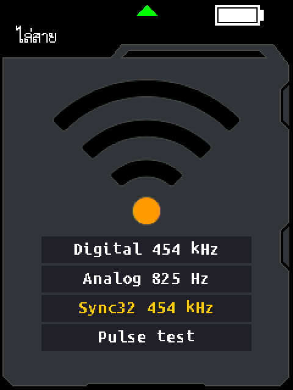

# Optional paired tracing: TX PN 2.13 / RX PN 1.10

**Update after device testing:** the owner reports Sync32 silent with RX PN 1.10
in digital mode while Digital/Analog work. Pulse test intentionally lacks a
probe-compatible code or 825 Hz tone. At the owner's request, both new options
are removed from the [PN 2.14 tone menu](TONE-RECOVERY-PN2.14-2026-09-20.md).
The report below records the original trial and its synthetic evidence; it is
not evidence that Sync32 works on hardware. The physical cause is unconfirmed.

These local experimental images add a longer digital code and a repeatable
transmitter pulse test while retaining the existing tracing modes. The TX tone
screen now displays the requested **Digital 454 kHz** and **Analog 825 Hz** labels.
The new Sync32 mode improves detection in several synthetic noise conditions,
but loses more clean windows under clock mismatch. It is an optional bench
candidate; hardware performance relative to Fluke or another probe is unmeasured.

## Files and operation

| Device | Candidate | SHA-256 |
|---|---|---|
| TX, main unit | [LPM-10A-TX_PN2.13-sync.bin](../LPM-10A/Firmware%20File/experimental/LPM-10A-TX_PN2.13-sync.bin) | `79ea4157e86e3a6613cb603d7e34e6b61e4f949844095b583bd4ff4f88da1fbd` |
| RX, probe | [APP_LPM-10RX_PN1.10-sync.bin](../LPM-10A/Firmware%20File/experimental/APP_LPM-10RX_PN1.10-sync.bin) | `6570f521054d77ee97c1a0e37e5a9da0a975d41d452e5f14e63aadb68a9f6e21` |

TX is 393,216 bytes, the same container size as PN 2.12. RX is 26,152 bytes,
the same raw-image size as PN 1.9. The owner subsequently flashed/tested this pair
and reported the failure above. These files have not been published.
The existing PN 2.12 TX and PN 1.8 RX releases remain available unchanged.

In the TX SCAN / tone-probe screen, the existing mode key cycles through:

| Display label | Signal | Matching receiver setting |
|---|---|---|
| Digital 454 kHz | Existing B6 code on the approximately 454 kHz carrier | Existing RX digital mode; works with earlier RX versions |
| Analog 825 Hz | Existing carrier keyed at approximately 825 Hz | RX analog mode |
| Sync32 454 kHz | New 32-chip code on the same carrier | PN 1.10 RX digital mode |
| Pulse test | Carrier on for 99.99 ms, off for 399.96 ms nominally | Oscilloscope/envelope diagnostic; no cable-ID interpretation |

The requested labels intentionally show **carrier frequency for Digital/Sync32**
and **modulation frequency for Analog**. Analog also uses the same carrier.
These rounded nominal values are not measurements from a connected device.
All four technical labels appear in both English and Thai UI modes.

 

RX PN 1.10 recognizes both digital codes automatically within its existing
digital mode; it does not add a key sequence or automatic analog/digital switch.
TX PN 2.13 starts in the original Digital mode. Back pauses the waveform and a
second Back exits, as before. Resume preserves the current waveform position;
entering either new mode through the mode key resets its new cursor.

## Transmitter implementation

`sdk/scan_sync.py` checks the exact finalized PN 2.12 parent before applying
changes. It adds 452 bytes of emitted code/data and a four-byte cursor at
`0x2000F138`. It fits within the existing allocated container; no further file
extension is required. The mode key initializes the cursor before publishing
the mode under a short critical section that preserves the previous PRIMASK.
The generator also bounds-checks its state before accessing the code table.

Sync32 emits `0x1F25EB11`, most significant bit first. On each nominal 101 us
TIM2 tick it emits the current bit, adds 808 to its accumulator, and advances
one chip when the accumulator reaches 40,025. This produces 49/50-tick chips
averaging 5.003125 ms, matching the nominal RX sample period. The mean frame is
160.100 ms. Matching nominal divisors does not provide clock recovery.

Pulse test uses 990 ON ticks followed by 3,960 OFF ticks. It provides a
repeatable envelope for measuring driver settling, probe response, clipping,
and recovery. It does not increase transmitter power or change carrier setup,
GPIO drive configuration, conductor routing, or the receiver's gain circuit.

The original Digital and analog generators remain byte-identical. The new
dispatcher stays within the original active-screen and enabled guards. Four
rows fit below the existing icon and remain visible in both languages.

## Receiver implementation

`rx-sdk/sync_fixes.py` requires the exact PN 1.9 parent. It changes only a
four-byte branch at `0x08009EEC` and an audited 28-byte unreachable padding tail
at `0x0800A9D4`. No new persistent RAM or further function compaction is needed.

The detector first tries all legacy B6 phases. After those fail, it tries all
32 Sync32 rotations using the existing 48-sample window and the same acceptance
limits: at most four errors total and two errors in each 16-sample block. If
Sync32 fails, the legacy exact-window fallback still runs. Tests establish
that a Sync32 acceptance cannot displace a previously valid legacy fallback.

The [PN 1.9 code-group median estimator](RX-ROBUST-PN1.9-2026-09-20.md) supplies
strength for both codes. Sync32's different rotations contain 21–27 high
samples per 48-sample window; odd/even median groups are tested. Distinct long
pulses still indicate accepted signals whose strength is unsuitable for
comparison. Sampling, gain GPIO, feedback publication guards, and analog and
mains analysis retain their PN 1.9 behavior. Vendor-facing RX identity remains
unchanged; the candidate is identified by its filename and checksum.

## Verification and limits

All **221 test groups passed** in the final runs: 50 TX groups, 142 prior RX
regression groups, 27 new RX/protocol/profile groups, and two paired transport
groups. Independent rebuilds match both delivered binaries byte-for-byte.
The earlier PN 2.12 TX and PN 1.8 RX hashes are unchanged.

The new TX tests exercise the complete 40,025-tick accumulator orbit, exact
legacy waveforms, three pulse periods, corrupt cursor recovery, atomic mode
publication, pause/resume/exit, full TIM2 dispatch, and all 16 combinations of
language, selected mode and enabled/paused state. Both full screens were
rendered through the firmware GUI and visually checked.

The RX tests cover all 32 phases, every single-bit error position, bounded
multiple errors, median ordering/outliers, mode/gate interruption, stack and
buffer bounds, padding references, and build-profile isolation. The entire
3,624-window legacy corpus retains the same feedback. Another 960 windows
match an independent TX timing, sampling, noise and clock-mismatch model.

`test_scan_pair.py` additionally runs the delivered TX ARM code, passes its
output through a synthetic envelope/ADC link, and executes the actual RX TIM5
five-reading reducer and detector. All 22 directed windows match the independent
feedback calculation, including intentionally difficult timing windows that
can be rejected. This establishes firmware interoperability under the modeled
link, not electrical interoperability on hardware.

Observed RX maximum over 185 adversarial windows: 14,685 retired instructions
and 152 bytes of stack, excluding caller and interrupt frames. The extension
adds no executed instructions to TIM1 or TIM5. In a 5,000-tick TX test, the
Sync32 TIM2 path used 96–109 emulated instructions and Pulse test used 92–106,
within the tested analog path's 100–128 range. Peripheral/service routines are
stubbed in this count; these are not cycle measurements or worst-case latency
proofs on hardware.

The [independent model and full tables](experiments/SCAN-SYNC-MODEL.md) reproduce
147,456 phase/noise windows and 81,920 dense clean windows. At equal raw signal
amplitude with uniform +/-100-count noise, Sync32 accepted 1,998/2,048 windows
versus 1,692/2,048 for legacy. Their duty factors differ, so this does not compare
equal average power.

There is a material tradeoff: in the dense clean nominal sweep, Sync32 accepted
8,090/8,192 windows (98.75%), versus every legacy window. At +/-3,000 ppm added
clock mismatch, Sync32 accepted about 88.7%; at +/-1% on the coarser grid, about
62%. The present fixed-phase detector has narrow sampling blind spots and no
fractional timing recovery. Retain Digital for comparison or when Sync32 is
intermittent. Timing recovery is the next protocol prerequisite before making
Sync32 the default.

A longer code does not distinguish an original signal from a copy coupled into
an adjacent cable. Both protocols remain accepted, so code-distance properties
alone do not establish a lower overall false-alarm rate. No increased range,
physical cable-selectivity improvement, or commercial-product superiority is
claimed from these tests.

## Reproduce

From `LPM-10A/Firmware File/sdk`:

```text
python build.py --scan-sync --write
python -m unittest test_scan_sync.ScanSync test_sync_profile test_portflash_status -q
```

From `LPM-10A/Firmware File/rx-sdk`:

```text
python build.py --sync --write
python -m unittest test_rx_sync test_sync_profile test_scan_pair -q
python -m unittest test_image test_roadmap test_firmware_audit test_rx_followup test_rx_precision test_rx_pinpoint test_rx_robust test_robust_profile -q
```

From the repository root:

```text
python docs/experiments/scan_sync_model.py
```

The original vendor RX image is required by the existing build tooling. Both
new profile flags are opt-in; default and earlier named profiles retain their
previous selections. Custom selections involving the new patches require an
explicit output path, preventing accidental overwrite of a default image.

## Hardware comparison still needed

Measure the actual carrier, envelope timings, receiver sampling interval and
relative clock error. Use Pulse test to inspect overload and recovery, then
compare Digital and Sync32 on the same cables, probe position and sensitivity.
Randomize the target in a realistic bundle and record target-to-neighbor
contrast, incorrect selections, time to identify, dropouts, and performance
while moving the probe. Include long and short cables and the operating
conditions relevant to the intended installation. These measurements decide
whether the optional mode helps the physical device.
