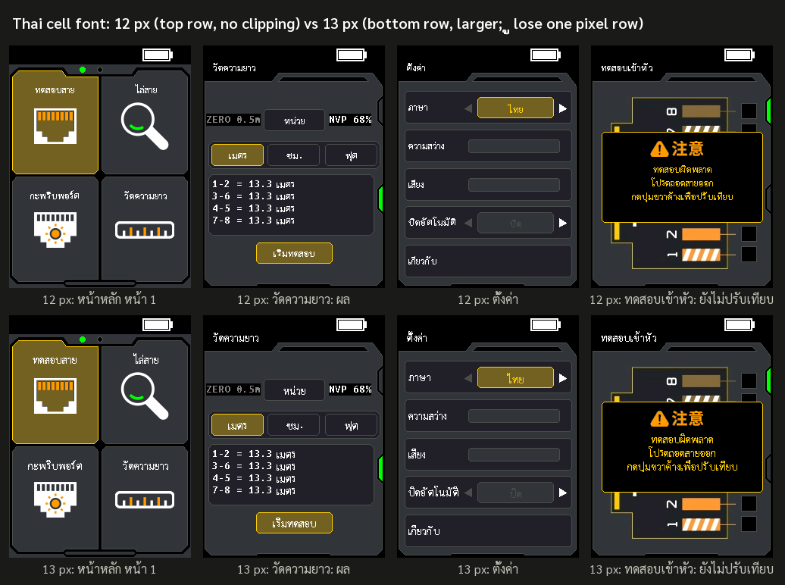

# Thai user interface (PN 2.0, proposal)

> **Status: mock-ups only.** Nothing here is built into a firmware file yet. The
> pictures were rendered by running the firmware's own drawing code under a CPU
> emulator (the same tooling `sdk/verify.py` uses) with the Chinese text drawers
> replaced by the proposed Thai ones, so the layout, colours and pixel positions are
> the real ones; only the wording still needs to be agreed. Then the patch gets
> written, verified by emulation and reviewed like every other PN change.

**สรุปภาษาไทย:** ข้อเสนอเปลี่ยนภาษาที่สองของเครื่องจาก "中文" เป็น "ไทย" ทุกหน้าจอ
ภาพด้านล่างเรนเดอร์จากโค้ดวาดหน้าจอจริงของเฟิร์มแวร์ (จำลองด้วย CPU emulator) จึงตรงตำแหน่ง
และสีจริง เหลือเพียงตัดสินใจเรื่องคำแปลและขนาดตัวอักษร (12 หรือ 13 px) ก่อนลงมือทำแพตช์
ตารางคำแปลอยู่ในหัวข้อ [Wording](#wording) แก้ได้ทุกคำ

## Every screen

Screen by screen, English (PN 1.3) / Chinese (stock strings) / Thai (proposal):

### Font size: 12 px or 13 px

The Thai glyphs are 1-bit bitmaps rendered from **Sarabun SemiBold** (SIL Open Font
License) with FreeType's monochrome hinting, one 16 × 16 cell per grapheme cluster
(consonant plus its vowel and tone marks), advanced proportionally. At 12 px every
one of the 92 clusters the interface needs, including stacked marks and the below-vowels
ุ ู, fits the 16-pixel cell. At 13 px the text is larger and easier to read on the 2.4-inch
panel, but ุ ู and ฐ lose one or two pixel rows at the bottom. Both are rendered below; the default in the mock-ups is 12 px.

## Wording

Strings are grouped by screen. "Centred" means the firmware centres the string on a
fixed point (buttons, tile names, dialog lines), so a Thai string of any width stays
centred; "left" means it starts at the same pixel as the Chinese one.

| Screen | English (PN 1.3) | Chinese (stock) | Thai (proposal) | Layout |
|---|---|---|---|---|
| Home / titles | Cable Test | 网线对接 | ทดสอบสาย | centred / left |
| | SCAN | 寻线 | ไล่สาย | |
| | FLASH | 端口闪烁 | กะพริบพอร์ต | |
| | Length | 长度测试 | วัดความยาว | |
| | QC Test | 压接测试 | ทดสอบเข้าหัว | |
| | SPEED | 网线速率 | ความเร็ว | |
| | POE | POE测试 | ทดสอบ PoE | |
| | SETTING | 设置 | ตั้งค่า | |
| Language picker | Language / English | 语言 / 中文 | ภาษา / ไทย | left / centred |
| Cable Test | Switch / Far end | 交换机 / 远 端 | สวิตช์ / ปลายสาย | centred |
| | Test Start / Test Retry | 开始测试 / 重新测试 | เริ่มทดสอบ / ทดสอบใหม่ | centred |
| | Result error!! | (English only) | ผลลัพธ์ผิดพลาด!! | new Thai branch |
| SCAN | Digital / 825 Hz | 抗干扰寻线 / 普通寻线 | ดิจิทัล / 825 Hz | centred |
| FLASH | Testing | 测试中 | กำลังทดสอบ | centred |
| | Please note LED | 请观察指示灯 | โปรดดูไฟ LED | centred |
| | It will start blinking when connection successful | 连接成功后开始闪烁 | จะกะพริบเมื่อเชื่อมต่อสำเร็จ | centred |
| | Connect timeout | 测试超时 | หมดเวลาเชื่อมต่อ | left |
| Length | Unit | 单位 | หน่วย | centred |
| | m / cm / ft | 英寸 / 厘米 / 米 (stock never relabelled these) | เมตร / ซม. / ฟุต | centred, and after each result |
| | Testing … | 测试中 | กำลังทดสอบ … | left; the dots move from x = 68 to x = 88 |
| | Out of range. | 超出测量范围 | เกินช่วงการวัด | left |
| | Test timeout!! | (English only) | หมดเวลาทดสอบ!! | new Thai branch; the line is cleared first |
| QC Test | Test error / Please remove cable / Then long press 'Right' / To Initialize | 测试出错 / 请移除网线后 / 长按右键校准 | ทดสอบผิดพลาด / โปรดถอดสายออก / กดปุ่มขวาค้างเพื่อปรับเทียบ | centred |
| SPEED | Speed / Link Type | 速率 / 双工模式 | ความเร็ว / ดูเพล็กซ์ | centred in the label box |
| | Full-duplex / Half-duplex | 全双工 / 半双工 | ฟูลดูเพล็กซ์ / ฮาล์ฟดูเพล็กซ์ | centred |
| | Error!! | (English only) | ผิดพลาด!! | new Thai branch |
| POE | Standard / Span Type / Protocol / Power Level | 交换机标准 / 供电方式 / 标准协议 / 功率等级 | ประเภท / รูปแบบจ่ายไฟ / โปรโตคอล / ระดับกำลัง | left |
| | Standard / Non-standard | 标准 / 非标准 | มาตรฐาน / ไม่มาตรฐาน | left |
| | END / MID | 末端跨接 / 中间跨接 | End-span / Mid-span | left |
| Settings | Language / Light / Volume / Auto Off / About | 语言 / 亮度 / 音量 / 自动关机 / 关于 | ภาษา / ความสว่าง / เสียง / ปิดอัตโนมัติ / เกี่ยวกับ | left |
| | English (current language) | 中文 | ไทย | centred |
| | OFF / 5min / 10min / 15min | OFF / 5分钟 / 10分钟 / 15分钟 | ปิด / 5 นาที / 10 นาที / 15 นาที | centred |
| About | About | 关于 | เกี่ยวกับ | left |
| | Software: / Hardware: / Model: | 软件号: / 硬件号: / 型  号: | ซอฟต์แวร์: / ฮาร์ดแวร์: / รุ่น: | left, moved 14 px left so the values fit |
| | Factory Reset | 恢复出厂设置 | คืนค่าโรงงาน | centred |
| Factory reset | Factory Reset will / erase all your settings | 恢复出厂设置会重 / 置之前所有的修改 | คืนค่าโรงงานจะลบ / การตั้งค่าทั้งหมด | centred |
| | YES / NO | 是 / 否 | ใช่ / ไม่ | left in the button |
| Low battery | Please Charge! / Shutting down soon | 电量低请及时充电 / 即将关机 | แบตเตอรี่ต่ำ โปรดชาร์จ / กำลังจะปิดเครื่อง | left / centred |

Kept as they are, in every language: pair names `1-2 3-6 4-5 7-8`, `ZERO 0.5m`,
`NVP 68%`, `1000Mbps`, `IEEE 802.3AT`, `Class 4`, the version and URL lines, the
`25s` countdown, and the two bitmaps that carry Chinese text (the "⚠ 注意" warning
header and the FNIRSI company name on the About page). Those two bitmaps can be
replaced by "⚠ คำเตือน" and a blank line if wanted; they are images, not strings.

Alternatives worth a thought: **ปลายสาย** (far end) could be **ตัวรับ** (the
receiver unit); **ดูเพล็กซ์** could be **โหมดลิงก์**; **ประเภท** for the PoE
"Standard" row could be **ชนิด**.

## How it will be built

All of this is the same kind of byte patch as PN 1.x, in `sdk/patches.py`, verified
by `sdk/verify.py` and reviewed before release.

1. **Glyph table.** Stock keeps 171 Chinese glyphs as 16 × 16 1-bit cells at
   `0x08066368` (32 bytes each). The Thai UI needs 92 clusters. The table is
   replaced by the Thai cells plus a 1-byte width table; the 79 unused slots
   (about 2.4 KB) hold the longer Thai strings and the new drawer.
2. **Text drawers.** Stock's `cjk_text` (`0x080176AC`) and `mixed_text`
   (`0x080173EC`) advance 16 px per glyph and, when `count != 0`, centre the string by
   `8 × count`. The Thai versions keep the same signatures, advance by each cell's
   width, and centre by the measured string width, so every call site keeps its
   anchor and no coordinates change. ASCII inside a mixed string (PoE, LED, 825 Hz,
   5 นาที) still uses the 8 × 16 font.
3. **Strings.** Every Chinese string (index bytes, `0xFF`-terminated) is rewritten
   with Thai cluster indices. Strings that grow past their slot move into the freed
   glyph space and the `adr` that referenced them becomes an `ldr` from a literal.
4. **Three layout tweaks**, shown in the mock-ups: the Length/Speed "…" animation
   moves from x = 68 to x = 88 (the Thai "Testing" is wider than the English one),
   the Length "Test timeout!!" clears its line and starts at x = 12, and the About
   labels move 14 px left.
5. **Language code.** The settings byte keeps `1 = English`; `2` becomes Thai
   instead of Chinese (the picker shows ไทย, the log still says "Chinese" inside).
   English stays exactly as PN 1.3.
6. **New Thai branches** for the four messages stock only has in English (result
   error, test timeout, speed error, duplex), each a language check plus a Thai
   string, like the existing Chinese branches.
7. **Verification.** `verify.py` gains a section that renders every screen in Thai
   through the real dispatcher (the mock-up engine is that test), checks each string
   against this table, and checks that no cell is drawn outside its box.

The tooling for the mock-ups (`ThaiFont` cell renderer, the screen emulator and the
scenario list) will be committed with the patch under `sdk/thai/`.
