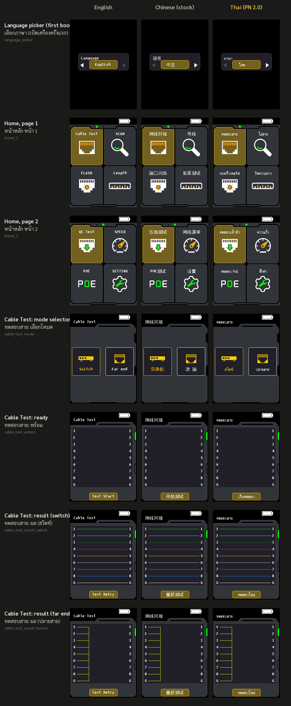
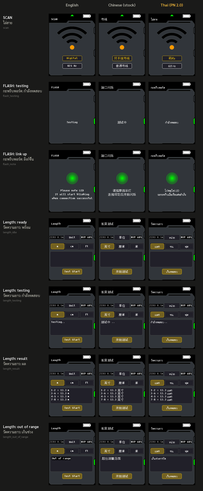
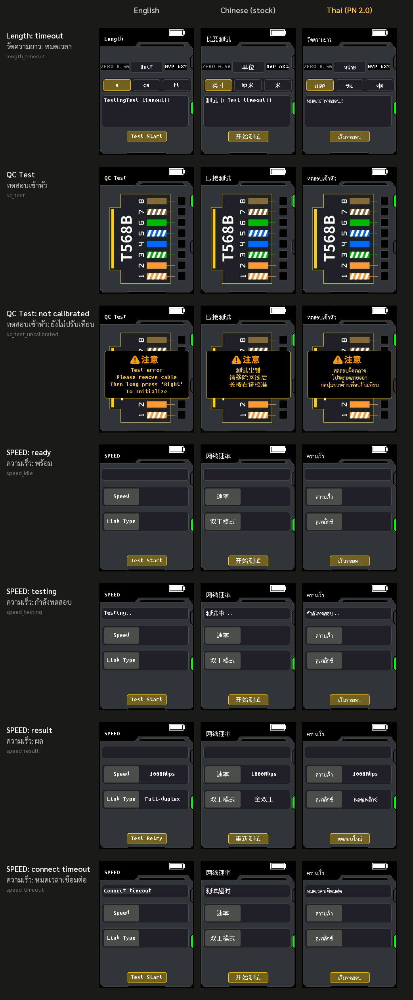
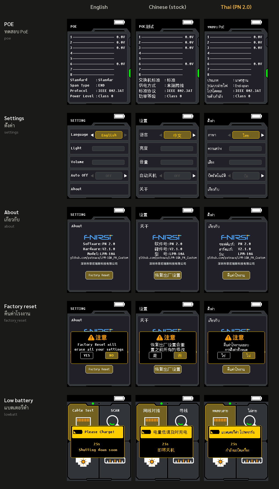

# Thai user interface (PN 2.0)

> **Status: shipped in PN 2.0 and passed on a real unit on 2026-09-18, every screen.**
> The pictures below are what the firmware draws: `verify.py` §19 runs the built image's
> own drawing code through the real GUI dispatcher for 56 screen states and compares the
> pixels with this design; it also proves the English screens are pixel-identical to the
> same build without the Thai patch (i.e. the patch changes nothing in English).

**สรุปภาษาไทย:** PN 2.0 เปลี่ยนภาษาที่สองของเครื่องจาก "中文" เป็น "ไทย" ทุกหน้าจอ (ทดสอบผ่านบนเครื่องจริงแล้ว 2026-09-18)
เลือกได้ที่ ตั้งค่า > ภาษา (Settings > Language) และหน้าเลือกภาษาจะขึ้นเมื่อเปิดเครื่องครั้งแรก
หรือหลังคืนค่าโรงงาน ภาพด้านล่างคือสิ่งที่เฟิร์มแวร์วาดจริง (ตรวจด้วย CPU emulator ทุกพิกเซล)
ตารางคำแปลอยู่ในหัวข้อ [Wording](#wording) — แก้ใน `sdk/thai/wording.py` แล้ว build ใหม่ได้

## Every screen

Screen by screen, English / Chinese (stock strings) / Thai (PN 2.0):

### The font

Sarabun SemiBold (SIL Open Font License) at 13 px, rendered by FreeType in monochrome
hinted mode into 16 × 16 one-bit cells, one cell per grapheme cluster (a consonant with
its vowel and tone marks). 118 cells cover the whole interface, Latin letters and digits
included; two of them are whole words (ใช่ / ไม่) for the two places where stock draws a
single glyph. Each cell advances by its own ink width plus one pixel, so the text is
proportional. The Length screen's "…" animation moves from x = 68 to x = 82, past the
wider Thai "Testing"; nothing else moves.

## Wording

Strings are grouped by screen. "Centred" means the firmware centres the string on a
fixed point (buttons, tile names, dialog lines), so a Thai string of any width stays
centred; "left" means it starts at the same pixel as the Chinese one.

| Screen | English | Chinese (stock) | Thai (PN 2.0) | Layout |
|---|---|---|---|---|
| Home / titles | Cable Test | 网线对接 | ทดสอบสาย | centred / left |
| | SCAN | 寻线 | ไล่สาย | |
| | FLASH | 端口闪烁 | กะพริบพอร์ต | |
| | Length | 长度测试 | วัดความยาว | |
| | QC Test | 压接测试 | ทดสอบเข้าหัว | |
| | SPEED | 网线速率 | ความเร็ว | |
| | POE | POE测试 | ทดสอบ PoE | |
| | SETTING | 设置 | ตั้งค่า | |
| Language picker | Language / English | 语言 / 中文 | ภาษา / ไทย | left / centred |
| Cable Test | Switch / Far end | 交换机 / 远 端 | สวิตช์ / ปลายสาย | centred |
| | Test Start / Test Retry | 开始测试 / 重新测试 | เริ่มทดสอบ / ทดสอบใหม่ | centred |
| | Result error!! | (English only) | ผลลัพธ์ผิดพลาด!! | hook, centred |
| SCAN | Digital / 825 Hz | 抗干扰寻线 / 普通寻线 | ดิจิทัล / 825 Hz | centred |
| FLASH | Testing | 测试中 | กำลังทดสอบ | centred |
| | Please note LED | 请观察指示灯 | โปรดดูไฟ LED | centred |
| | It will start blinking when connection successful | 连接成功后开始闪烁 | จะกะพริบเมื่อเชื่อมต่อสำเร็จ | centred |
| | Connect timeout | 测试超时 | หมดเวลาเชื่อมต่อ | left |
| Length | Unit | 单位 | หน่วย | centred |
| | m / cm / ft | 英寸 / 厘米 / 米 (stock never relabelled these) | เมตร / ซม. / ฟุต | centred, and after each result |
| | Testing … | 测试中 | กำลังทดสอบ … | left; the dots move from x = 68 to x = 82 |
| | Out of range. | 超出测量范围 | เกินช่วงการวัด | left |
| | Test timeout!! | (English only) | หมดเวลาทดสอบ!! | hook: the line is wiped, then drawn from x = 12 |
| QC Test | Test error / Please remove cable / Then long press 'Right' / To Initialize | 测试出错 / 请移除网线后 / 长按右键校准 | ทดสอบผิดพลาด / โปรดถอดสายออก / กดปุ่มขวาค้างเพื่อปรับเทียบ | centred |
| SPEED | Speed / Link Type | 速率 / 双工模式 | ความเร็ว / ดูเพล็กซ์ | centred in the label box |
| | Full-duplex / Half-duplex | 全双工 / 半双工 | ฟูลดูเพล็กซ์ / ฮาล์ฟดูเพล็กซ์ | centred |
| | Error!! | (English only) | ผิดพลาด!! | hook, left |
| POE | Standard / Span Type / Protocol / Power Level | 交换机标准 / 供电方式 / 标准协议 / 功率等级 | ประเภท / รูปแบบจ่ายไฟ / โปรโตคอล / ระดับกำลัง | left |
| | Standard / Non-standard | 标准 / 非标准 | มาตรฐาน / ไม่มาตรฐาน | left |
| | END / MID | 末端跨接 / 中间跨接 | End-span / Mid-span | left |
| Settings | Language / Light / Volume / Auto Off / About | 语言 / 亮度 / 音量 / 自动关机 / 关于 | ภาษา / ความสว่าง / เสียง / ปิดอัตโนมัติ / เกี่ยวกับ | left |
| | English (current language) | 中文 | ไทย | centred |
| | OFF / 5min / 10min / 15min | OFF / 5分钟 / 10分钟 / 15分钟 | ปิด / 5 นาที / 10 นาที / 15 นาที | centred (ปิด through the hook) |
| About | About | 关于 | เกี่ยวกับ | left |
| | Software: / Hardware: / Model: | 软件号: / 硬件号: / 型  号: | ซอฟต์แวร์: / ฮาร์ดแวร์: / รุ่น: | left, at x = 57 instead of 71 so the values fit |
| | Factory Reset | 恢复出厂设置 | คืนค่าโรงงาน | centred |
| Factory reset | Factory Reset will / erase all your settings | 恢复出厂设置会重 / 置之前所有的修改 | คืนค่าโรงงานจะลบ / การตั้งค่าทั้งหมด | centred |
| | YES / NO | 是 / 否 | ใช่ / ไม่ | one whole-word cell each, where stock draws one glyph |
| Low battery | Please Charge! / Shutting down soon | 电量低请及时充电 / 即将关机 | แบตเตอรี่ต่ำ โปรดชาร์จ / กำลังจะปิดเครื่อง | left / centred |

Kept as they are, in every language: pair names `1-2 3-6 4-5 7-8`, `ZERO 0.5m`,
`NVP 68%`, `1000Mbps`, `IEEE 802.3AT`, `Class 4`, the version and URL lines, the
`25s` countdown, and the two bitmaps that carry Chinese text (the "⚠ 注意" warning
header and the FNIRSI company name on the About page). Those two bitmaps can be
replaced by "⚠ คำเตือน" and a blank line if wanted; they are images, not strings.

To change a word: edit `sdk/thai/wording.py`, run `python -m thai.cells` (rebuilds the
cell table if a new cluster appeared), `python build.py --write`, `python verify.py`.

## How it is built

The `thai-ui` patch in `sdk/patches.py`, verified by `sdk/verify.py` §19 and reviewed
adversarially before release (like every PN change).

1. **Glyph table.** Stock keeps 171 Chinese glyphs as 16 × 16 1-bit cells at
   `0x08066368` (32 bytes each). The table now holds the 118 Thai cells
   (`sdk/fonts_out/thai16.bin`, built by `python -m thai.cells` from Sarabun); the
   53 unused slots (1696 bytes) hold the width table, the strings, the redirect
   table, the two drawers and the hook (1496 bytes used).
2. **Text drawers.** Stock's `cjk_text` (`0x080176AC`) and `mixed_text`
   (`0x080173EC`) advance 16 px per glyph and, when `count != 0`, centre the string by
   `8 × count`. The Thai versions (`sdk/thai/drawers.py`) keep the same signatures,
   advance by each cell's width, and centre by the measured string width, so every
   call site keeps its anchor and no coordinates change. A mixed string that is not
   Thai (the English "Switch" / "Far end" boxes) is drawn exactly as stock draws it.
3. **Strings.** No Chinese slot is rewritten in place: each of the 64 slots
   (`sdk/thai/sites.py`) holds a redirect stub, `[cell, 0xAC, index, 0xFF]` (3 bytes in
   the unit table) or `[0x0100, 0x01AC, index, 0]` for the u16 kind, that the drawers
   resolve through a pointer table to the Thai text. The stubs fit the smallest stack
   copy any caller makes (4 bytes), so every `adr`, `ldm`, `memcpy` and strided-table
   reference in stock stays as it is.
4. **Three layout tweaks**: the Length/Speed "…" animation moves from x = 68 to
   x = 82 (the Thai "Testing" is wider than the English one), the Length "Test
   timeout!!" wipes its line and starts at x = 12, and the About labels start at
   x = 57 instead of 71. The first two happen inside the hook, so English is untouched.
5. **Language code.** The settings byte keeps `1 = English`; `2` is Thai instead of
   Chinese (the picker and Settings show ไทย). English stays exactly as PN 1.3; the
   first-boot picker (English / ไทย) is shown again on a fresh unit and after a
   Factory Reset (PN 1.x skipped it, which left a factory-reset unit in Chinese).
6. **A hook on `gui_blit`** (the ASCII text drawer) that, only while the language is
   Thai, replaces the four messages stock had in English alone ("Result error!!",
   "Test timeout!!", "Error!!", "OFF") and moves the "…" animation; every other
   string falls through untouched.
7. **Verification** (`verify.py` §19, 15 checks): the cell table in the image is the
   shipped one and every cell renders through the stock glyph drawer as designed; all 64
   stubs resolve to this wording; the routines are byte-identical to their assembled
   sources and the three jumps are in place; the hook table matches `wording.py`; the
   drawer unit test; then every one of 56 screen states drawn by the built firmware in
   Thai is pixel-identical to the model (a build without the Thai patch with the Chinese
   drawers intercepted and the Thai text drawn from the same cells), every state in
   English is pixel-identical to that build, and every Thai string is drawn at least
   once.
