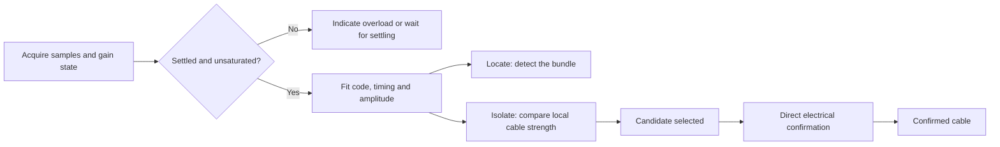

# LPM-10A tone and probe: design for reliable cable selection

Date: 2026-09-20. Status: engineering proposal, with one reproduced PN 1.8
CPU experiment. No firmware image was changed, built, flashed, or released
for this study.

Implementation follow-up: [RX PN 1.9 local candidate](RX-ROBUST-PN1.9-2026-09-20.md)
implements the first strength-estimation stage and adds a distinct indication
for unsuitable comparisons. See that report for the built artifact, CPU
results, and pending device checks; later hardware and timing proposals here
remain future work.

The recommended architecture is **Locate -> Isolate -> Confirm**. First find
the bundle, then compare individual cables with fast and comparable signal
measurements, then establish an electrical connection to the selected cable.
The main performance objective is fewer confidently wrong cable selections,
followed by faster identification. Maximum detection distance is a separate
objective.

## What the professional benchmark actually does

Fluke documents distinct maximum-radiation Locate, minimum-radiation Isolate,
and conductor-by-conductor Verify signals. Its probe separates signal-strength
indication from recognition of its digital signal, and offers direct CableMap
verification. These are useful functional requirements; its public documents
do not disclose enough to reproduce its proprietary decoder.
[Fluke IntelliTone datasheet](https://www.flukenetworks.com/content/datasheet-intellitone-pro-toner-and-probe-series).

Fluke also acknowledges that severe bleed between cables can make isolation
difficult. An accepted code identifies a received waveform; a coupled copy on
a neighboring cable contains that same code. Neither a longer code nor CRC
alone proves which cable is connected to the transmitter.
[Fluke isolation guidance](https://www.flukenetworks.com/knowledge-base/intellitone/isolating-individual-cable-intellitone).

Pro3000F provides mains-interference filtering. SmartTone uses a deliberate
short/open of the selected pair to change the generated tone, restricted to
dry, unterminated pairs. That is a useful example of electrical confirmation,
not an operation to apply to live Ethernet or PoE wiring.
[Pro3000 family datasheet](https://www.flukenetworks.com/createpdf/en/edocs/datasheet-pro3000-tone-and-probe-family),
[SmartTone instructions](https://www.flukenetworks.com/knowledge-base/pro3000-toner-and-probe/pro3000-smarttone-positive-identification).

Matching these functions on the LPM-10A requires its own hardware measurements.
No evidence here establishes parity with Fluke or a universal best product.

## Current implementation and its limits

| Area | Evidence in this repository | Practical consequence |
|---|---|---|
| TX waveform | About 454 kHz carrier, digital 5.05 ms slots, repeating `0xB6B6`; alternate mode keys the carrier at about 825 Hz | `B6B6` is two copies of `B6`: the independent pattern repeats every 8 slots, or 40.4 ms |
| RX acquisition | Five sub-readings produce one digital sample about every 5 ms; 48 samples per completed window | Approximately 240 ms between digital analyses; no sub-slot timing recovery |
| RX recognition | Threshold about the trimmed mean; two exact sliding `B6B6` matches OR bounded bit errors across eight phases | Useful noise rejection and legacy compatibility, but raw amplitude information is lost in the hard-bit decision |
| RX strength | Sum of absolute deviations after removing one minimum and maximum | Good clean-signal amplitude ordering; multiple impulses or partial-pattern windows can mislead the score |
| PN 1.8 feedback | Interpolated 20-160 ms quiet gaps, 30 ms pulses, 3 ms deadband | More feedback resolution, without a faster detector or calibrated physical selectivity |
| Gain/level path | PA2 sampled about every 500 ms; a three-bit value drives PB12-PB14 | Whether these pins control gain, attenuation, or indication remains unconfirmed |
| Patch space | 26,152-byte RX image, in-place patching, recovered RAM/stack layout | A new sampler or larger DSP routine needs an explicit memory and timing budget |

Source locations:

- [TX SCAN timing and protocol](../LPM-10A/Firmware%20File/sdk/patches.py), `scan_labels` / `scan-timing`, around lines 1093-1164.
- [RX detector and strength](../LPM-10A/Firmware%20File/rx-sdk/precision_fixes.py), around lines 57-180.
- [RX feedback mapping](../LPM-10A/Firmware%20File/rx-sdk/pinpoint_fixes.py).
- [Sampling ownership and level updates](../LPM-10A/Firmware%20File/rx-sdk/sampling_fixes.py).
- [PN 1.8 behavior and validation limits](RX-PINPOINT-PN1.8-2026-09-19.md).
- [Recovered hardware, clocks, and gain uncertainty](RX-AUDIT.md).

The earlier RX audit includes historical defects and proposals; PN 1.4-1.8
already corrected ADC completion, buffer ownership, overflow, and feedback
issues described in the later reports. Those fixes are not new proposals here.

The existing exact-match route can recognize two overlapping 16-bit matches
eight samples apart. Those matches cover only 24 distinct samples. Acceptance
therefore does not establish a perfect code fit across the entire 48-sample
window. A replacement strength estimator must handle that distinction.

## Reproduced weakness: interference can reverse the strength ranking

The following experiment executed the actual published PN 1.8 detector and
mapper in the existing Unicorn harness, with modeled ADC input. It did not
simulate the analog front end or establish the prevalence of this situation
on real cables.

| Input window | Accepted | Current strength score | Published quiet gap | Expected-group median difference |
|---|---:|---:|---:|---:|
| Clean `B6`, low 1000 / high 1100 | Yes | 2144 | 109 ms | 100 counts |
| Clean `B6`, low 1000 / high 1150 | Yes | 3222 | 100 ms | 150 counts |
| First window, with four impulses | Yes | 4144 | 95 ms | 100 counts |

The impulses add 1000 at indices 0 and 2 (expected highs), and subtract 1000
at indices 1 and 4 (expected lows). All ADC values remain within 0-4095. One
high and one low extreme are removed by the existing metric, but two remain.
The weaker underlying signal then produces faster feedback than the clean
stronger signal.

The median calculation uses the known synthetic code phase. It demonstrates
an estimator opportunity, not a complete replacement detector. Phase search,
clock drift, residual checks, and partial matches still need engineering.

Image SHA-256:
`a588af8e0883fca119b9ed00e30761502ec0c4e0d2b6fee16a67c8b7cacc615d`.

## Priority 1: separate strength, code quality, and overload

Keep three measurements with distinct meanings:

1. **Strength:** amplitude associated with the expected transmitted code.
2. **Code quality:** how consistently the samples fit that code and its timing.
3. **Overload:** whether clipping, analog compression, or a gain transition
   makes the measurement unreliable.

For a candidate phase and symbol period, model envelope samples as
`x[n] = b + A*c[n] + e[n]`, with `c[n]` equal to 0 or 1. Estimate `b` and `A`
robustly. A simple prototype uses medians or trimmed means of the expected-zero
and expected-one groups; a more flexible version uses robust regression with
a measured envelope template. Strength is the difference between those fitted
levels, not total signal variation.

If using ordinary least squares as a reference, center the template:

```text
q[n] = c[n] - mean(c)
A = sum(q[n] * (x[n] - mean(x))) / sum(q[n]^2)
b = mean(x) - A * mean(c)
e[n] = x[n] - b - A*c[n]
```

`B6` has five ones and three zeros. An uncentered +/-1 correlation would retain
DC bias. Ordinary least squares is still vulnerable to impulses; use it as a
reference and evaluate robust alternatives on captured data.

Code quality should consider residual spread, outlier rate, fit consistency
between code periods, and separation from competing phase hypotheses. A robust
residual statistic alone can miss sparse impulses, so retain an outlier count
or residual-energy guard. Correlation quality must not be presented as a
probability that the physical cable is correct.

Start by preserving existing find eligibility and evaluating the new metric
alongside it. Partial exact matches and drifting windows may remain audible
in Locate while having insufficient quality for a fine Isolate comparison.
Do not let a new full-window threshold silently discard useful legacy finds.

The current detector overwrites its snapshot with hard bits. Implementation
must preserve the raw samples until amplitude fitting is complete. Median
selection, phase search, scratch memory, and execution time need budgets;
there is no assumption that this fits the existing detector slot unchanged.

Detect samples near ADC rails, but also characterize compression before the
rails: an analog limiter can flatten amplitude without ever returning 4095.
An overloaded reading should request lower sensitivity or greater distance,
not be reported as an especially certain cable match.

## Priority 2: measure and control the analog gain path

Identify PA0's envelope transfer function, PA2's source, PB12-PB14's destination,
and the role of the physical sensitivity control. Measure each available gain
state using the same injected signal across input levels and battery voltages.

If a controllable amplifier/attenuator is confirmed, calibrate its transfer
function and settling time. Convert fitted ADC amplitude to comparable input
amplitude; a simple `A_input = A_ADC / gain` is valid only in its characterized
linear range. Otherwise use a measured lookup curve. Keep gain fixed during
a short A/B cable comparison when headroom permits. Any necessary gain change
invalidates the comparison until the front end settles.

In Locate, allow sensitivity changes to acquire weak signals. In Isolate,
favor stable gain and unsaturated measurements. If gain is only manually
controlled and not observable, require the same setting for the comparison
and describe the result as relative strength.

Reducing TX power or RX gain can recover headroom and make weak responses less
distracting. In a linear system it scales both target and leaked signals; it
does not inherently improve their ratio. Greater software sensitivity also
does not create physical selectivity.

## Priority 3: track quickly while preserving reliable acquisition

Replace isolated 240 ms blocks with a rolling acquisition design after the
strength/gain work has established a trustworthy measurement.

Initial design targets, to be accepted or rejected by measurements:

| Quantity | Proposed starting point | Constraint |
|---|---|---|
| Envelope sampling | About 800 samples/s, roughly four samples per current TX slot | Verify envelope bandwidth, ADC settling and timer/interrupt budget |
| Tracking update | Every 20-40 ms after lock | Overlapping windows are correlated, not independent confirmations |
| Fast tracking window | Approximately 80-120 ms | About 2-3 current `B6` periods; less integration means less noise tolerance |
| Weak-signal acquisition | Approximately 160-240 ms | Longer integration remains useful at low SNR |
| Release target | Approximately 80-120 ms after loss | Must be measured end-to-end, including window history and audio scheduling |

Search fractional slot phase and a bounded symbol-rate range, then track
timing. The current RX and TX slot lengths differ by about 1% even before
oscillator error. Changing the RX timer to nominally match TX is not a
substitute for timing recovery.

Use cheap sample acquisition in the interrupt and bounded main-loop work.
Double buffering or sequence-tagged ring buffers must preserve the existing
ownership guarantees across mode requests and gain/gate changes. Audit stack
headroom, ADC serialization, battery conversions, speaker PWM, and worst-case
interrupt time on the device. DMA is an option only if the actual MCU/peripheral
mapping and available resources support it.

An update every 20 ms is not a 20 ms detection latency. For intuition, a probe
moving at 20 cm/s travels 4.8 cm in the current 240 ms window. Even without a
range improvement, less lag can make adjacent-cable comparisons easier. This
is a motion calculation, not a measured device result.

## Priority 4: make the operating logic match the user's task



**Locate:** use a conservative recognition gate, useful weak-signal integration,
and stable feedback while finding the bundle. Keep background estimation from
adapting away a persistent valid tone: update it from suitable no-code periods
or validated residuals, with bounded adaptation.

**Isolate:** use calibrated/fixed-gain amplitude, faster tracking, and a short
release. Let the operator explicitly capture a reference on cable A and compare
cable B at the same tip distance and orientation. Reset the reference after a
gain/mode change, overload, or timeout. Do not let an indefinite peak hold hide
the fact that the probe has moved away from the candidate.

For a calibrated linear amplitude, the comparison can be expressed as
`20*log10(A_B/A_A)`. Require both measurements above the usable floor. Determine
the useful comparison margin from repeatability tests; do not invent a fixed
dB threshold that supposedly proves identity. A large margin selects a
candidate, not a verified cable.

Map strength to cadence or pitch, code lock to a separate brief indication,
and overload to a distinct warning pattern. Preserve volume as a listening
preference, independent of sensitivity where the hardware permits. Evaluate
audio choices with users: the existing 3 ms gap difference is numerical
resolution, not proof of an audible benefit. Use the existing speaker and
documented LEDs; the RX has no screen. Validate key gestures before assigning
new long presses or reusing indicators.

**Confirm:** use the tester's supported direct wiremap/remote workflow or port
identification workflow as appropriate. The current RX has no demonstrated
CableMap input path. An automatic remote-response feature requires an actual
electrical path and validated sensing; an on-air code/CRC or a universal TX
cadence change alone does not establish which neighboring cable is connected.

## Priority 5: coordinate a new TX/RX protocol only where it helps

Keep the existing `B6` and 825 Hz modes for compatibility. A new paired mode
could use a longer sequence chosen for useful autocorrelation, a transmitter
ID, and an error-detected frame. Evaluate synchronization, transition density,
duty cycle, weak-signal performance, and coexistence with other toners.

Longer sequences trade identification time for integration and code diversity.
For example, 31 current 5.05 ms slots already occupy about 156.6 ms before
headers or repeats. Use a short tracking signal plus less-frequent identity
frames if measurements justify that complexity. Faster slots depend on the
analog envelope bandwidth, not just timer programmability.

IDs distinguish transmitters. They do not distinguish a directly driven cable
from another cable carrying a coupled copy of that transmitter's waveform.
Frequency diversity may reveal a more useful operating band, but also needs
measured TX coupling and RX frequency response; software frequency hopping
cannot bypass a fixed analog filter.

A physical Locate/Isolate output mode could be more valuable than a new code.
Investigate the driven conductors, output balance, common-mode current, source
impedance, and switching topology. Selectable conductor/pair drive or a lower
radiation configuration is conditional on that hardware map. The wiremap mux
is not evidence that tone routing can be switched through it. Existing TX code
uses PA8/PB13 in the carrier gate; do not infer the complete RJ45 drive topology
from GPIO names alone.

Fluke's active-network capability is a property of its complete hardware and
specified operating modes. A digital waveform change cannot establish that
the LPM-10A has equivalent active-Ethernet/PoE compatibility.

## Hardware changes if the existing front end is the limiting factor

After characterization, evaluate a smaller shielded sensing tip, better
isolation from the operator's hand, lower-noise input circuitry, and a calibrated
attenuator with enough headroom for close contact. For a new probe design, a
second sensing element can support a spatial-gradient measurement that helps
reject broadly distributed pickup. It also introduces matching, orientation,
noise and mechanical constraints; it is a research option, not a guaranteed
improvement or a firmware capability of the present single-input probe.

On the transmitter, improved balance and a validated choice of conductor drive
may reduce unwanted radiation while preserving local detectability. Increasing
output power alone is a poor bundle-isolation objective. Shielded cables and
terminations need separate testing because they change the available field.

## How to prove improvement

Compare PN 1.8, each candidate, and an IntelliTone Pro 200 in randomized blind
tests. Use each device's own appropriate transmitter and documented connection
mode. Measure the complete user workflow as well as the receiver metrics.

| Test dimension | Suggested cases |
|---|---|
| Bundle | 12, 24 and 48 cables; target at center and edge; short/long parallel sections |
| Cable | Cat5e/Cat6/Cat6A, shielded/unshielded; representative short, medium and long runs |
| Termination | Open, patch panel and supported switch-connected operation, evaluated separately |
| Interference | Mains and harmonics, switching supplies, nearby analog toner, another coded toner |
| Handling | Fixed tip geometry, realistic sweep speed, different hand positions, sensitivity changes |
| Signal extremes | Weak coupling, strong close contact, recovery from overload, removal/reacquisition |
| Power | Full and low battery, with the same geometry and drive conditions |

Primary metrics are correct-selection rate, confident wrong-selection rate,
inconclusive rate, and median/95th-percentile time to select and confirm.
Measure target-to-strongest-neighbor contrast, false locks, amplitude
repeatability, acquisition/release latency, and overload recovery as diagnostic
metrics. Count an inconclusive result separately; a device should not improve
its apparent safety by becoming unusably reluctant to select anything.

Record known identity and probe position separately from signal confidence.
Replay captured ADC traces through both reference algorithms and actual ARM
instructions. Include the four-impulse counterexample, partial-pattern exact
fallbacks, clock drift, gain changes, ADC rail and sub-rail compression, and
same-code neighbor signals. Test CPU behavior and real analog performance
separately. A trace/telemetry path is itself engineering work; do not assume an
existing USB logging interface or flood the timing-critical sampler with logs.

Use explicit exposure counts and confidence intervals. Zero wrong selections
in a small test is not a zero-error guarantee; roughly 300 independent,
representative trials with zero errors give an approximate 95% upper error
bound of 1% for that tested population. Repeated sweeps of one unchanged bundle
are not independent installations, and choosing thresholds on the evaluation
set would overstate performance.

## Recommended implementation order

1. **Establish measurements:** characterize gain/level pins, saturation and
   envelope bandwidth; capture a labeled baseline bundle dataset.
2. **First RX prototype:** robust code-conditioned strength with separate
   quality/overload state; retain the existing sampling and find path while
   comparing results. Correct the demonstrated interference ranking weakness.
3. **Second RX prototype:** rolling, timing-aware acquisition and explicit
   Locate/Isolate behavior, after memory and interrupt budgets are demonstrated.
4. **Paired TX/RX research:** longer IDs and physically distinct output modes
   only where captures show a benefit and the circuitry supports them.
5. **Hardware revision:** improve spatial pickup and drive balance if firmware
   reaches the measured front-end limit.

The strongest immediate investment is **trustworthy strength plus fast local
comparison**. The strongest proof of identity is **electrical confirmation**.
These address different failure modes and should remain separate in the UI,
tests and performance claims.

## Reproduce the CPU experiment

Run this Python snippet from `LPM-10A/Firmware File/rx-sdk` with the repository's
existing Unicorn/Capstone dependencies and PN 1.8 binary. It reads that binary;
it does not rebuild or overwrite firmware.

```python
from pathlib import Path
from statistics import median
import hashlib
from test_rx_pinpoint import Pinpoint
from test_rx_precision import strength
from verify_digital import pattern
from test_rx_followup import GRADE

t = Pinpoint()
t.data = Path('../experimental/APP_LPM-10RX_PN1.8-pinpoint.bin').read_bytes()
assert hashlib.sha256(t.data).hexdigest() == (
    'a588af8e0883fca119b9ed00e30761502ec0c4e0d2b6fee16a67c8b7cacc615d')
code = pattern(low=0, high=1)
weak = pattern(low=1000, high=1100)
impulses = weak.copy()
for i in (0, 2):
    impulses[i] += 1000
for i in (1, 4):
    impulses[i] -= 1000
for name, samples in (
    ('clean_100', weak),
    ('clean_150', pattern(low=1000, high=1150)),
    ('100_plus_four_impulses', impulses),
):
    cpu = t.cpu()
    accepted = t.detect(cpu, samples, recent=0, grade=0)
    amplitude = (
        median([x for x, b in zip(samples, code) if b])
        - median([x for x, b in zip(samples, code) if not b]))
    print(name, accepted, strength(samples), cpu.read(GRADE), amplitude)
```
