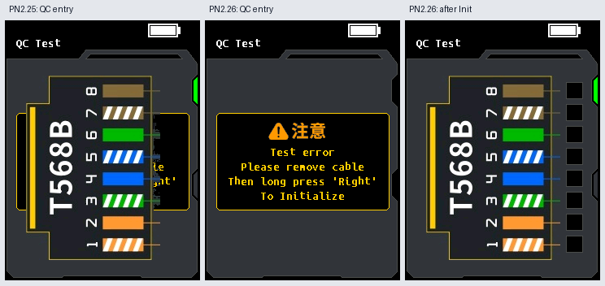

# PN2.26: fix the garbled QC entry screen

The owner reports that PN2.25's screen becomes garbled **immediately when
opening QC Test**. This is reproduced in the actual queued GUI path: the
T568B connector artwork paints over the Init prompt. PN2.26 fixes the draw
ordering and retains PN2.25's acquisition timing correction, PN2.24's Length
fixes, and the classic automatic QC interface.

**Accepted on 2026-09-22:** the owner reports testing **all functions on the
physical device with PN2.26 and passing**. PN2.26 is accepted as the default
TX release. This owner-reported hardware result is separate from the
automated SDK results recorded below.

Use the accepted
[`LPM-10A-TX_PN2.26-qc-display.bin`](../LPM-10A/Firmware%20File/LPM-10A-TX_PN2.26-qc-display.bin)
from [release v2.26](https://github.com/patnawa/LPM-10A_PN_Custom/releases/tag/v2.26).
If QC shows the original Init prompt, disconnect all cables and hold Right
until Init succeeds. A successful normalized Init already saved by PN2.25
remains usable in PN2.26.



These images are rendered from emulated firmware instructions, not camera
captures. The corrected entry and post-Init images were visually inspected
and compared pixel-for-pixel with the original prompt and classic artwork.

## Cause and correction

Entering QC posts header message `0x36` followed by frame message `0x0C`.
The old header drew the normal QC frame before calibration was validated.
That frame queued connector bitmap `0x3B`, placing it behind `0x0C`. When
`0x0C` rejected the legacy calibration, it drew the Init prompt immediately;
the queued connector then painted over that prompt.

This error-view interaction existed in PN2.24 with an invalid baseline.
PN2.25's required calibration migration exposed it on normal upgrade entry.
The previous tests checked mode, prompt text, and stable redraws, but did not
compare the complete final prompt framebuffer. Their passing result therefore
missed the visual defect. The baseline validation hook's register/stack
handling was separately checked and was not the cause.

The new `sdk/qc_entry_display.py` changes three guarded sites:

- `0x08069DD4`: defer the initial header until the queued frame has decided
  whether to show normal QC or the Init prompt.
- `0x0800BA66`: render the native connector bitmap synchronously as part of
  its frame, so it cannot arrive after a later prompt.
- `0x0800F48C`: reject an old queued connector bitmap outside the normal QC
  view; delegate all other messages to the existing Length-aware dispatcher.

The original full/error renderers and their clearing behavior remain intact.
Stable results still draw no pixels; only changed pin indicators update.
The patch adds no RAM, changes no timing/threshold/calibration code, and does
not change the previous firmware builders or archived binaries.

## Regression evidence

Before the fix:

```powershell
python -W ignore::ResourceWarning -m unittest test_qc_entry_display -q
```

The real entry path failed its full-frame assertion: **35,050 pixels**
differed from the unobscured original Init prompt in language 1 and **35,052**
in language 2. A late queued connector message also overpainted the prompt.
Suppressing only that queued message removed the overlapping artwork in an
independent causal probe.

The new tests cover both language settings, the complete entry framebuffer,
successful Init returning to exact classic artwork, late connector messages
after the prompt or Back, unrelated bitmap dispatch, and zero pixel writes
while waiting for Init or displaying stable automatic results. They also run
the six physical-frequency/timing integration cases on the complete PN2.26
candidate. Build checks verify the exact three-site patch allowlist, preserved
Length dispatcher and measurement code, deterministic output, container
bounds, rejection of an incorrect parent, startup canaries and zero new RAM.

Run from `LPM-10A/Firmware File/sdk`:

```powershell
python qc_display.py --write
python -W ignore::ResourceWarning -m unittest test_qc_entry_display test_qc_display_build -q
python -W ignore::ResourceWarning -m unittest discover -q
```

The firmware validation suite passed **478 tests in 327.797 seconds**. After
promoting the exact binary to the default profile, the final release suite
passed **481 tests in 253.016 seconds**, including default and explicit PN2.26
CLI builds and all historical profile digests. An
independent review additionally ran all seven Length message-guard cases on PN2.26 and
checked that a discarded bitmap's payload is freed once with a balanced stack.
The written artifact matches a fresh build and its SHA256 manifest. After
delivery, the owner confirmed on **2026-09-22** that all functions passed on
the physical device. That acceptance report does not change the scope or count
of the automated tests above.

## Artifact

The builder accepts only the exact PN2.25 parent with SHA256
`b6d407b662331bf4cf2fdb4f007a595cf75c61d31fa4986dea47d23aaf3c25ae`.
PN2.26 has 401,408 bytes, payload length `0x60558`, and exclusive payload end
`0x0806A558`: 120 more payload bytes than PN2.25 and no increase in the padded
update size. SHA256:

```text
c77579f018bb820532b3c5974ae63fbf04c4e60359188f7e39a8a8f9a1533df8
```

The archived
[`TX-PN2.26-SHA256SUMS.txt`](../LPM-10A/Firmware%20File/experimental/TX-PN2.26-SHA256SUMS.txt)
records the digest. Both version strings identify PN2.26. The accepted PN2.26
default TX release supersedes PN2.25; its binary is unchanged from the artifact
tested and accepted by the owner.
